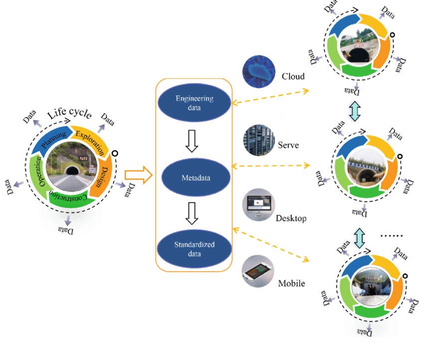
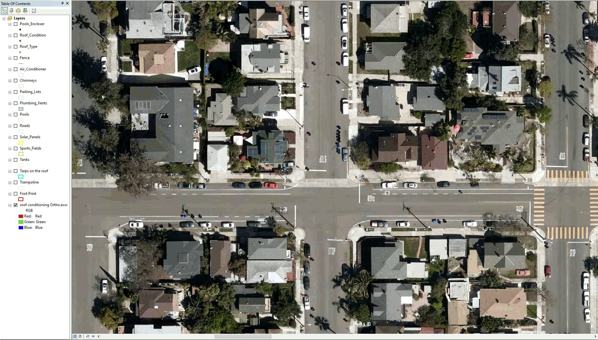

# Geospatial Data and Preparation for GeoAI

## Nature of Geospatial Data in AI Workflows

In traditional GIS, data is often viewed in terms of layers, symbology, and spatial relationships. In GeoAI workflows, the same data must be understood differently — as **structured numerical input** for learning algorithms.

For project managers, this shift in perspective is critical. The question is no longer just “Do we have this layer?”, but rather:

* Is the data in a form that an AI model can learn from?
* Does it represent the variability of the real world?
* Can it be consistently linked across datasets?

Understanding how raster and vector data function in AI workflows is the foundation of data readiness.

### Raster Data as Numerical Information

In GeoAI, raster data is not just imagery — it is a grid of numbers.

Each pixel contains one or more values that represent measurable properties of the Earth’s surface, such as reflectance in different spectral bands, elevation, or temperature.

From a machine learning perspective:

* Each pixel or group of pixels becomes a set of numerical inputs
* Multiple bands or derived layers act as multiple input variables
* The model learns patterns in these numbers, not visual “pictures”

Operational implications:

1. Consistency matters
   Differences in resolution, band order, or value ranges can confuse models.

2. More bands do not automatically mean better results
   Additional data must be relevant and consistently available.

3. Derived layers (indices, terrain models) can add value
   These may provide clearer signals than raw bands alone.

Manager’s viewpoint:

* Raster datasets should be treated as structured numeric data, not just background imagery
* Data preparation must ensure alignment, consistency, and proper documentation of band meanings

Manager’s checkpoint:

* Are all raster inputs aligned to the same resolution and projection?
* Are band definitions and value ranges documented?
* Are we mixing sensors with very different characteristics?

### Vector Data as Labels and Reference Information

In AI workflows, vector data plays a different role than in traditional GIS.

Rather than being final products, many vector layers become **labels** that teach the model what patterns to recognize.

Examples:

* Building footprints used to teach building detection
* Land cover polygons used to train classification models
* Road centerlines used to guide road extraction models

These vectors act as “ground truth” during training.

Operational implications:

1. Accuracy of vectors directly affects model learning
   Errors in reference data are learned by the model.

2. Class definitions must be consistent
   If “urban” is labeled differently in different regions, the model will learn conflicting patterns.

3. Coverage must represent real variability
   Labels from only one city or landscape type will not generalize well.

Manager’s viewpoint:

* Existing GIS datasets are strategic assets for GeoAI training
* Quality control of reference layers is essential before using them as training data

Manager’s checkpoint:

* Are vector layers up to date and accurate enough for training?
* Do labeling standards vary across regions or projects?
* Do reference datasets cover different environmental and urban contexts?

### Multi-source and Multi-resolution Data

GeoAI projects often combine data from multiple sources, such as optical imagery, radar data, elevation models, and existing GIS layers.

They may also involve different spatial resolutions — for example, combining 10 m satellite imagery with sub-meter aerial photography.

While this can improve model performance, it introduces complexity.

Operational implications:

1. Resolution mismatch
   Models trained at one resolution may not perform well at another without adjustment.

2. Sensor differences
   Data from different satellites may have different spectral properties, noise levels, and acquisition conditions.

3. Alignment challenges
   All layers must be spatially aligned and properly resampled.

4. Temporal differences
   Datasets from different dates may not represent the same ground conditions.

Manager’s viewpoint:

* More data sources increase potential value but also increase risk if not managed carefully
* Standardization and documentation become critical when multiple datasets are used

Manager’s checkpoint:

* Are all datasets spatially aligned and temporally compatible?
* Are we training on one data source and applying to another?
* Have we tested performance across different resolutions and sensors?

## From GIS Layers to AI-Ready Data

Having data in a GIS does not automatically mean it is ready for AI. Many GIS layers are designed for visualization, storage, or manual analysis, whereas GeoAI requires data that is **consistent, well-structured, and free from hidden inconsistencies**.

For project managers, this stage is often underestimated. Yet, poor preparation here can undermine even the most advanced modeling efforts.

### Data Cleaning and Standardization

GIS datasets often accumulate inconsistencies over time, especially when compiled from multiple sources or projects. These issues may not affect map display but can significantly impact AI training.

Common problems include:

* Inconsistent attribute values (for example, different codes for the same class)
* Topological errors in vector layers (gaps, overlaps, slivers)
* Mixed naming conventions or schema differences
* Outdated features that no longer reflect ground reality

Standardization involves:

* Harmonizing class names and definitions
* Removing duplicate or irrelevant attributes
* Ensuring consistent field formats and value ranges
* Cleaning geometry errors in vector layers

Management implication:
Data cleaning is not a minor technical task. It is a **quality assurance phase** that determines how reliably a model can learn.

Manager’s checkpoint:

* Are class definitions documented and consistent across datasets?
* Have obvious geometric and attribute errors been corrected?
* Do different regional datasets follow the same schema?

### Projection, Resolution, and Alignment

AI models assume that input data layers correspond spatially. If layers are misaligned or use different coordinate systems, the model may learn incorrect relationships.

Key preparation steps include:

* Converting all layers to a common coordinate reference system
* Ensuring raster layers have the same pixel size and grid alignment
* Resampling datasets carefully when resolutions differ
* Verifying that vector labels correctly overlay raster inputs

Even small misalignments can result in labels not matching the underlying imagery, which directly degrades training quality.

Management implication:
Spatial alignment is not just a GIS technical detail; it is fundamental to ensuring that the model learns from correct input-output relationships.

Manager’s checkpoint:

* Are all raster inputs aligned to the same grid and resolution?
* Has reprojection been handled consistently across datasets?
* Do labeled features accurately overlay the imagery used for training?

### Handling Missing and Noisy Data

Geospatial datasets often contain gaps or noise that are acceptable for visual interpretation but problematic for machine learning.

Examples include:

* Cloud cover or shadows in optical imagery
* Missing data values in elevation or sensor products
* Artifacts from sensor errors or processing issues

If not handled properly, models may learn patterns related to noise rather than real-world features.

Preparation steps may involve:

* Masking clouds and shadows
* Filling or flagging missing values
* Filtering obvious artifacts
* Excluding poor-quality scenes from training

Management implication:
Quality control of input data directly influences model reliability. Ignoring noisy or incomplete data can introduce systematic errors that only become visible after deployment.

Manager’s checkpoint:

* Have low-quality scenes been filtered or masked?
* Are missing values documented and handled consistently?
* Could noise patterns be mistaken by the model as real features?

## Training Data: The Foundation of GeoAI

In GeoAI projects, training data is the single most important determinant of success. Algorithms and software can be changed, but the model can only learn from the examples it is given. If the training data is incomplete, inconsistent, or biased, the model will reproduce those weaknesses at scale.

For project managers, training data should be treated as a **core project asset**, not a side task.

### What Makes Good Training Data

Good training data is not just accurate — it is also representative.

Key characteristics include:

Coverage of variability  :
Training examples should reflect different regions, seasons, land cover types, and urban forms. A model trained only on one landscape type will struggle elsewhere.

Balanced class representation  :
If some classes (for example, water bodies or informal settlements) are rare in the dataset, the model may ignore them or perform poorly on them.

Accurate and up-to-date labels  :
Outdated or incorrect labels teach the model the wrong patterns, which can be difficult to detect later.

Clear class definitions  :
Each category should have a precise and shared definition. Ambiguous boundaries between classes lead to inconsistent training signals.

Management implication:
High-quality training data requires planning, not just collection. It often involves deliberate sampling across different geographies and conditions.

Manager’s checkpoint:

* Does the dataset represent the full range of expected operating environments?
* Are rare but important classes adequately represented?
* Are label definitions documented and agreed upon?

### Sources of Training Data in Mapping Organizations

Mapping organizations often already possess valuable datasets that can serve as training data.

Common sources include:

Existing GIS layers :
Building footprints, road networks, and land use maps can be converted into labels for training.

Topographic or thematic maps :
Digitized map products can provide class boundaries and feature information.

Field survey data :
GPS observations, ground truth points, and field-verified records improve reliability.

Manual interpretation projects :
Past digitizing efforts or mapping campaigns can be repurposed as labeled datasets.

Management implication:
Leveraging existing authoritative datasets reduces annotation effort but requires quality assessment before use.

Manager’s checkpoint:

* Which existing layers can be repurposed as training data?
* How current are these datasets?
* Do they follow consistent standards across regions?

### Labeling Guidelines and Consistency

Labeling is not just drawing polygons; it is a controlled process that must follow defined rules.

Key elements of good labeling practice:

Clear annotation guidelines :
Define what should and should not be labeled, including edge cases.

Consistency across annotators :
Different individuals must apply the same interpretation standards.

Quality control and review :
Samples of labeled data should be reviewed for errors and inconsistencies.

Version control :
Changes to labeling definitions should be documented to maintain traceability.

Management implication:
Inconsistent labeling leads to inconsistent models. Governance over annotation processes is as important as the annotation itself.

Manager’s checkpoint:

* Are labeling instructions documented and shared?
* Is there a review mechanism for annotated data?
* Are labeling standards stable across time and teams?

### Cost and Effort of Data Annotation

Data annotation is often the most labor-intensive component of a GeoAI project.

Effort depends on:

* Feature complexity (for example, buildings vs land cover)
* Image resolution (higher resolution requires more detailed labeling)
* Area size and diversity
* Required accuracy level

Underestimating annotation effort can delay projects and reduce model performance due to insufficient training data.

Management implication:
Annotation should be budgeted and scheduled as a major project phase, not treated as a minor preparatory task.

Manager’s checkpoint:

* Has annotation time and cost been realistically estimated?
* Is there sufficient staff or contractor capacity?
* Are we prioritizing areas that provide maximum training value?

## Sampling Strategies for Spatial Data

In many non-spatial machine learning projects, random sampling is sufficient for training and evaluation. In geospatial applications, this assumption often fails because nearby locations tend to be similar. Without careful sampling design, models may appear accurate during testing but perform poorly when deployed in new regions.

For project managers, sampling strategy is a key factor in ensuring that reported performance reflects real-world operational conditions.

### Why Random Sampling is Not Enough in Geography

Geospatial data is spatially autocorrelated, meaning nearby locations often share similar characteristics. For example, buildings in the same neighborhood tend to have similar shapes and materials, and land cover types often occur in clusters.

If training and testing samples are drawn randomly from the same area, the model may simply learn local patterns. When evaluated on nearby test data, performance appears high because the conditions are nearly identical.

However, when applied to a different region with different building styles, vegetation types, or terrain, the model may fail.

Management implication:
Random sampling can lead to overly optimistic accuracy estimates that do not reflect performance in new geographic areas.

Manager’s checkpoint:

* Were training and testing samples geographically separated?
* Could test data be too similar to training data due to proximity?
* Is reported accuracy representative of the full operational area?

### Spatially Distributed Sampling

Spatially distributed sampling ensures that training data covers different regions, environments, and landscape types. Instead of concentrating samples in one area, samples are drawn from multiple, geographically distinct locations.

Approaches include:

* Stratifying samples by region, land cover type, or climate zone
* Ensuring urban, rural, coastal, and mountainous areas are represented
* Deliberately including edge cases and less common feature types

This improves the model’s ability to generalize beyond the areas where data was initially collected.

Management implication:
Sampling should be planned to reflect the geographic diversity of the deployment area, not just areas where data is easiest to obtain.

Manager’s checkpoint:

* Do training samples represent different environmental and urban contexts?
* Are remote or less accessible regions included?
* Have we included examples from both typical and unusual conditions?

### Train, Validation, and Test Splits in Spatial Projects

In machine learning, datasets are typically divided into three parts:

Training data is used to teach the model.
Validation data helps tune model settings and avoid overfitting.
Test data is used to evaluate final performance.

In spatial projects, these splits should be geographically separated whenever possible. For example, entire districts or regions may be reserved for testing, rather than mixing nearby samples.

This approach provides a more realistic estimate of how the model will perform in new areas.

Management implication:
Proper data splitting requires planning and may reduce the amount of data available for training, but it increases confidence in reported performance.

Manager’s checkpoint:

* Are training, validation, and test areas geographically distinct?
* Is test data truly independent from training data?
* Does evaluation include regions with different characteristics from the training set?

## Class Imbalance and Rare Features

In many geospatial datasets, not all features occur with equal frequency. Large areas may be dominated by common classes such as vegetation or built-up land, while critical features like small water bodies, narrow roads, or specific infrastructure elements may be rare.

Machine learning models tend to perform best on classes that appear frequently in the training data. As a result, rare but operationally important features may be poorly detected if class imbalance is not addressed deliberately.

### Why Some Features Are Underrepresented

Class imbalance occurs naturally in geographic data because landscapes are not evenly distributed.

Examples include:

* Large areas of agriculture compared to small settlements
* Extensive forest regions with relatively few water bodies
* Sparse infrastructure in rural areas

Operational datasets often reflect real-world proportions, which means rare features may represent only a small fraction of the total training data.

Management implication:
If training data mirrors raw geographic proportions without adjustment, models may focus on dominant classes and effectively ignore rare ones.

Manager’s checkpoint:

* Which classes are rare but operationally important?
* Does the training dataset include enough examples of these features?
* Are rare classes being overshadowed by dominant land cover types?

### Operational Risks of Imbalanced Data

Imbalanced data can create misleading performance results.

A model may achieve high overall accuracy by correctly classifying dominant classes while consistently missing rare but important features.

Examples of operational risks:

* Missing small but critical infrastructure elements
* Under-detecting flood-prone low-lying areas
* Failing to identify rare land cover types that have regulatory importance

Such failures may not be obvious if evaluation metrics are dominated by common classes.

Management implication:
Project success should not be judged solely by overall accuracy. Performance on critical minority classes must be examined separately.

Manager’s checkpoint:

* Are evaluation reports showing class-wise performance?
* Could rare but high-impact features be systematically missed?
* Are operational decisions sensitive to errors in minority classes?

### Strategies to Address Imbalance

Several strategies can help mitigate class imbalance:

Targeted sampling :
Deliberately collect more training examples from areas where rare features occur.

Data augmentation :
Create additional training examples through transformations such as rotations or cropping, particularly for image-based tasks.

Class weighting :
Adjust the training process so that errors on rare classes are penalized more strongly than errors on common classes.

Separate evaluation metrics :
Report performance separately for each class, especially for those that are operationally critical.

Management implication:
Addressing class imbalance requires deliberate design choices in both data preparation and model evaluation.

Manager’s checkpoint:

* Have we intentionally increased representation of rare but important features?
* Are model settings adjusted to account for imbalance?
* Do reports include performance metrics for each critical class?

## Spatial and Temporal Variability

GeoAI models do not learn universal truths. They learn patterns that exist in the data they have seen. When those patterns change across regions, seasons, or sensors, model performance can degrade — sometimes without obvious warning.

For project managers, variability is a deployment risk. A model that performs well in one location, season, or data source may not generalize reliably elsewhere unless variability has been explicitly addressed during training and validation.

### Regional Differences in Landscape and Built Environment

Geographic regions differ in materials, patterns, and spatial structure.

Examples:

* Building shapes, roof materials, and spacing differ between dense urban cores and rural settlements
* Road appearance varies between paved highways, dirt roads, and narrow mountain paths
* Vegetation structure differs between tropical forests, temperate zones, and dry shrublands

A model trained primarily on one type of environment may fail in another because the visual or spectral patterns differ significantly.

Management implication:
Training data must deliberately include examples from the range of environments where the model will be deployed. Otherwise, performance will be region-specific rather than nationally or globally reliable.

Manager’s checkpoint:

* Does training data include multiple geographic and socio-environmental contexts?
* Has the model been tested in regions that look different from training areas?
* Are deployment areas outside the environmental conditions represented in training?

### Seasonal Effects in Satellite Imagery

Many surface features change appearance over time due to seasonal cycles.

Examples:

* Agricultural fields vary dramatically between planting, growing, and harvest periods
* Forest canopy appearance changes between leaf-on and leaf-off conditions
* Snow cover, flooding, or dry-season water reduction alter spectral signatures

If training data is collected in only one season, the model may not recognize the same features under different seasonal conditions.

Management implication:
Temporal coverage in training data is essential for applications that rely on imagery acquired throughout the year.

Manager’s checkpoint:

* Does the training dataset include imagery from different seasons?
* Could seasonal appearance changes affect classification or detection?
* Is the operational imagery acquisition season consistent with training data?

### Sensor and Resolution Variability

GeoAI models are sensitive to the characteristics of the sensors that produced the input data.

Differences may include:

* Spatial resolution (e.g., sub-meter aerial imagery vs 10 m satellite data)
* Spectral bands and radiometric properties
* Viewing angles and illumination conditions
* Sensor types (optical vs radar)

A model trained on one sensor or resolution may not perform well on another without retraining or adaptation.

Management implication:
Data source consistency must be part of deployment planning. Changing imagery providers or resolutions mid-project can invalidate previously trained models.

Manager’s checkpoint:

* Is the deployment imagery from the same sensor and resolution as the training data?
* Have we tested the model on alternative data sources if they may be used operationally?
* Is there a plan for retraining if sensor characteristics change?

## Data Volume, Storage, and Management

GeoAI projects operate at data scales that are often much larger than traditional GIS workflows. High-resolution imagery, multi-band datasets, and large training collections quickly lead to terabytes of data. Without proper data management, technical bottlenecks and operational delays become inevitable.

For project managers, planning for data volume and traceability is as important as planning for models and algorithms.

### Data Size Considerations in GeoAI

Unlike many GIS projects that focus on vector layers or medium-resolution rasters, GeoAI often requires:

* Large volumes of high-resolution imagery
* Multi-temporal datasets for change detection
* Multiple derived layers (indices, terrain models)
* Separate copies of data for training, validation, and testing

This increases storage requirements and data transfer loads.

Management implications:

* Data storage and backup strategies must be planned early
* Data movement between systems (local, cloud, processing environments) can affect timelines
* Costs for storage and compute often scale with data volume

Manager’s checkpoint:

* Do we know the approximate size of all input and derived datasets?
* Is there sufficient storage and backup capacity?
* Could data transfer speeds become a bottleneck?

### Tiling and Patch-Based Processing

GeoAI models typically cannot process entire large images at once due to memory and computing limits. Instead, imagery is divided into smaller tiles or patches.

These tiles are used for:

* Training (feeding manageable image segments to the model)
* Inference (processing large areas piece by piece)

Tiling introduces operational considerations:

* Tile size affects model performance and processing efficiency
* Overlapping tiles may be required to avoid edge artifacts
* Outputs from tiles must be mosaicked back into seamless maps

Management implications:

* Processing workflows must include tiling and recombination steps
* Data organization becomes more complex with thousands of image tiles
* Quality checks are needed to ensure seamless final outputs

Manager’s checkpoint:

* Has the workflow accounted for tiling and reassembly of results?
* Are there standards for tile size and overlap?
* How will outputs from multiple tiles be merged and validated?

### Metadata and Data Lineage

In GeoAI, datasets evolve through multiple processing stages: raw imagery, cleaned inputs, labeled training data, model outputs, and updated versions. Without clear documentation, it becomes difficult to trace how a result was produced.

Metadata should capture:

* Data source and acquisition date
* Sensor and resolution information
* Processing steps applied
* Version history of training datasets and labels

Data lineage ensures that outputs can be traced back to the inputs and methods that produced them. This is critical for auditability, reproducibility, and long-term maintenance.

Management implications:

* Poor documentation increases risk when models are updated or audited
* Data lineage supports transparency and accountability
* Clear versioning prevents confusion between old and new datasets

Manager’s checkpoint:

* Is metadata consistently recorded for all datasets used in the project?
* Can we trace a model output back to the specific training data version?
* Are dataset versions controlled and archived systematically?

## Data Governance and Quality Control

GeoAI outputs influence maps, statistics, and decisions that may have legal, financial, or operational consequences. Unlike exploratory analysis, production GeoAI requires disciplined governance so that results are explainable, repeatable, and defensible.

For managers, governance is not about bureaucracy; it is about **risk control**. Without proper documentation and tracking, it becomes impossible to explain why a model produced a certain result or how to update it safely.

### Documentation of Training Data Sources

Every dataset used for training should be clearly documented. This includes both raster inputs and vector labels.

Key elements to record:

* Data source (organization, satellite, survey, etc.)
* Acquisition dates and temporal coverage
* Spatial resolution and coordinate reference system
* Known limitations or quality issues
* Preprocessing steps applied before training

Why this matters:
Models learn from the specific characteristics of the data they see. If those characteristics are not recorded, future users cannot determine whether a model is suitable for new data or conditions.

Manager’s checkpoint:

* Do we know exactly which datasets were used for training?
* Are acquisition dates and sensor details recorded?
* Are known data limitations documented and communicated?

### Versioning of Datasets

Training data and derived datasets change over time. Labels are corrected, new regions are added, and preprocessing methods evolve. Without version control, it becomes unclear which data version was used to train a particular model.

Versioning involves:

* Assigning clear identifiers to each dataset release
* Archiving older versions rather than overwriting them
* Recording changes made between versions

Why this matters:
When model performance changes or errors are discovered, teams must be able to link results back to the exact dataset version used during training.

Manager’s checkpoint:

* Are training datasets stored with version identifiers?
* Are previous versions archived and accessible?
* Is there a record of what changed between dataset versions?

### Traceability for Audit and Reproducibility

Traceability means being able to follow the full path from raw input data to final model output. Reproducibility means that, given the same data and configuration, the process can be repeated with the same results.

In GeoAI projects, traceability should cover:

* Input datasets and their versions
* Training parameters and model configurations
* Processing workflows and software environments
* Evaluation datasets and results

Why this matters:
When outputs are questioned — for example, in regulatory or operational contexts — teams must be able to explain how the result was produced and, if necessary, reproduce it.

Manager’s checkpoint:

* Can we trace a model output back to specific input data and processing steps?
* Are model training settings documented?
* Could another team reproduce the results using the same documented workflow?

## When is Data “AI-Ready”?

A GeoAI project does not start with choosing a model. It starts with determining whether the available data is suitable for learning. Many projects fail not because algorithms are weak, but because the data was never prepared to support reliable training and deployment.

For managers, “AI-ready” data means the dataset is **consistent, representative, well-documented, and aligned with the intended operational use**.

### Data Readiness Checklist for GeoAI Projects

Before approving or launching a GeoAI initiative, the following conditions should be reviewed:

Data consistency :
All input raster layers share the same projection, resolution, and alignment. Vector labels accurately overlay imagery.

Representative coverage :
Training data includes examples from different regions, environments, and conditions where the model will be deployed.

Clear class definitions :
Categories are well defined, documented, and consistently applied across the dataset.

Adequate sample size :
Each important class has enough examples to support learning, especially rare but operationally critical features.

Temporal and sensor alignment :
Training imagery matches the season, sensor type, and resolution expected in operational use.

Quality-controlled labels :
Training labels have been reviewed for errors, inconsistencies, and outdated information.

Documented metadata :
Sources, acquisition dates, preprocessing steps, and dataset versions are recorded.

Planned data splits :
Training, validation, and testing areas are geographically separated to ensure realistic evaluation.

Management implication:
If multiple checklist items are incomplete, the project is likely to face performance, reliability, or credibility issues later.

Manager’s checkpoint:

* Can we clearly explain how training data represents the operational environment?
* Are labeling standards documented and reviewed?
* Is there a defined validation strategy using independent areas?

### Common Red Flags in Early-Stage Projects

Certain warning signs often indicate that a GeoAI project is not yet data-ready:

Training data from a single region :
Models may appear accurate locally but fail elsewhere.

Inconsistent or unclear class definitions :
Different teams label similar features differently.

Misalignment between imagery and labels :
Vector layers do not match the imagery used for training.

Heavy cloud cover or seasonal bias :
Training data does not reflect the range of operational conditions.

No independent test areas :
Performance is evaluated on data too similar to training data.

Outdated reference layers :
Labels do not reflect current ground conditions.

Management implication:
These issues often lead to inflated performance claims during development and disappointing results during deployment.

Manager’s checkpoint:

* Are we seeing strong results only in limited areas?
* Has anyone verified label quality independently?
* Are we evaluating the model in truly new geographic areas?

## Key Takeaways for Project Managers

GeoAI initiatives are often perceived as technology-driven projects, but in practice their success depends far more on data readiness than on the choice of algorithm. Senior decision-makers play a critical role in ensuring that projects begin with realistic expectations about data quality, coverage, and governance.

### Why Most GeoAI Projects Succeed or Fail at the Data Stage

GeoAI systems learn from examples. If those examples are incomplete, biased, or inconsistent, the system will reproduce those weaknesses at scale.

Common success factors:

* Training data represents the diversity of real-world conditions
* Labels are accurate and consistently defined
* Data from different sources is aligned and standardized
* Evaluation is performed on geographically independent areas

Common failure factors:

* Overreliance on data from a limited region
* Poor-quality or outdated labels
* Misalignment between imagery and reference layers
* Lack of documentation and version control

Management implication:
Early investment in data preparation reduces downstream costs associated with poor performance, retraining, and loss of stakeholder confidence.

Manager’s checkpoint:

* Is sufficient time and budget allocated for data preparation?
* Are we relying on convenience data rather than representative data?
* Have independent reviews of training data quality been conducted?

### Questions to Ask Before Approving a GeoAI Initiative

Before approving a GeoAI project, decision-makers should seek clear answers to the following:

Data readiness :
Do we have sufficient, representative, and well-labeled training data?

Operational scope :
Are the geographic regions and conditions where the model will be used clearly defined?

Validation strategy :
How will performance be evaluated, and are test areas independent from training areas?

Class definitions :
Are categories clearly defined and agreed upon across teams?

Data governance :
Are data sources documented, versioned, and traceable?

Maintenance planning :
Is there a plan for updating training data and retraining models as conditions change?

Management implication:
These questions help ensure that GeoAI initiatives are grounded in realistic data and operational considerations rather than in purely technical optimism.

Manager’s checkpoint:

* Are we approving a technology experiment or a data-driven operational system?
* Have data-related risks been identified and addressed?
* Do we understand the long-term responsibilities associated with maintaining the model?