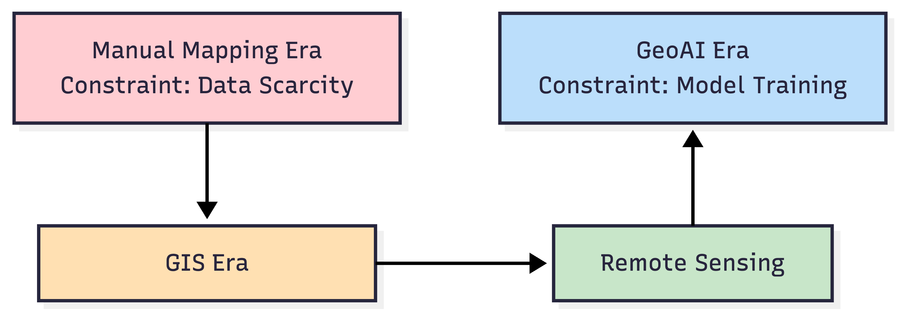

# What is GeoAI? Concepts, History & Ecosystem

## The Evolution of Mapping and Spatial Analysis

GeoAI is not a technological fashion — it is a response to **structural pressure in modern mapping operations**. To understand where GeoAI fits, we must look at how the *role of mapping agencies* has changed over time.

### Mapping Before Computers — The Era of Scarcity

In the pre-digital era, the limiting factor in mapping was **data availability**.

Maps were produced through:

* Field surveys
* Manual drafting
* Visual interpretation

#### Operational Characteristics

* Data collection was slow and expensive
* Map production cycles were long
* Updates were infrequent
* Accuracy depended heavily on human expertise

#### Management Implication

The challenge was **getting data**.
Most resources were spent on **measurement and compilation**, not analysis.

#### Decision Reality of That Era

* Mapping projects were rare, high-effort undertakings
* Revisions were strategic, not frequent
* Coverage was prioritized over update speed

#### Manager’s Checkpoint — Era of Scarcity

If you were managing mapping in this era, your key questions would be:

* Do we have enough field teams?
* Can we complete national coverage?
* How often can we afford map revisions?

### Rise of GIS — The Era of Digital Efficiency

With GIS, the constraint shifted from **data capture** to **data management and analysis**.

GIS enabled:

* Layered spatial databases
* Faster map updates
* Spatial querying and modeling
* Integration of multiple datasets

#### Operational Shift

Mapping moved from **drawing maps** to **managing spatial information systems**.

#### However — A Key Limitation Remained

GIS tools relied on **explicit rules defined by experts**.

Examples:

* Buffer this road by X meters
* Classify slope above threshold
* Overlay and intersect datasets

GIS automated workflows, but **humans still defined the logic**.

#### Management Implication

The constraint shifted from:

> “How do we collect data?”
> to
> “How do we structure, store, and analyze digital spatial data?”

#### Manager’s Checkpoint — Era of GIS

Key decisions became:

* What data standards should we adopt?
* How do we maintain spatial databases?
* How do we ensure interoperability across departments?

### Remote Sensing — The Era of Data Abundance

Satellite and aerial imaging transformed mapping again — this time by **removing the scarcity of imagery**.

Today we have:

* Frequent satellite revisits
* High-resolution urban imagery
* Drone surveys for local projects
* Multispectral and radar data

#### The New Constraint

We no longer struggle to get imagery.
We struggle to **interpret it at scale**.

Manual image interpretation by experts is:

* Time-consuming
* Expensive
* Difficult to scale nationally
* Inconsistent across analysts

#### Management Implication

The bottleneck moved again:

> From data availability → to human interpretation capacity.

#### Manager’s Checkpoint — Era of Data Abundance

You now face questions like:

* How quickly can we update national layers from new imagery?
* Do we have enough trained interpreters?
* How do we maintain consistency across teams?

### The Need for Automation — Enter GeoAI

We are now in the **era of geospatial big data**.

Imagery volume is growing faster than:

* Human interpretation capacity
* Budget for manual mapping
* Time available for updates

#### This Creates an Operational Gap

| Resource                       | Situation Today |
| ------------------------------ | --------------- |
| Imagery                        | Abundant        |
| Skilled interpreters           | Limited         |
| Time for updates               | Decreasing      |
| Demand for geospatial products | Increasing      |

#### This is Where GeoAI Emerges

GeoAI addresses a management-level problem:

> **How do we scale interpretation without scaling manpower proportionally?**

Instead of manually defining every rule, we now:

* Provide examples of features
* Let models learn patterns
* Apply those patterns over large areas automatically

#### Important Clarification for Managers

GeoAI is **not**:

- ❌ A replacement for GIS
- ❌ A replacement for expert oversight

GeoAI is:

- ✔ A scaling tool
- ✔ A way to handle repetitive visual interpretation
- ✔ A method to accelerate updates
- ✔ A support system for experts, not a substitute

#### Manager’s Checkpoint — Era of GeoAI

Key strategic questions now become:

* Which mapping tasks are repetitive enough for AI?
* Do we have historical labeled data to train models?
* What accuracy is acceptable for operational use?
* How do we integrate AI outputs into existing GIS workflows?

### Visual Summary — Evolution of Operational Constraints

## From AI to GeoAI

Artificial Intelligence becomes GeoAI when learning-based methods are applied to **spatially referenced data** and used to produce **geographically meaningful outputs**.

Not all AI applied to maps is automatically GeoAI. GeoAI specifically deals with the unique properties of geospatial data — location, spatial relationships, scale, and spatial dependence — which significantly affect how models must be trained, validated, and deployed.

For managers, this distinction matters because spatial data introduces **constraints and risks** that do not exist in general AI projects.

### What Makes Geospatial Data Unique

Geospatial data differs from typical business or sensor datasets in several fundamental ways:

1. Every data point has a location
   Observations are tied to coordinates, not just attributes.

2. Neighboring locations are often related
   Nearby pixels or features tend to be similar (for example, land cover or urban structures).

3. Multiple data types are integrated
   Raster imagery, vector features, elevation models, and temporal layers are often combined.

4. Scale and resolution matter
   A model trained on 30 m imagery may not work on 50 cm imagery without adjustment.

5. Time is often a factor
   Seasonal changes, urban growth, and environmental shifts affect model performance.

Management implication:
GeoAI projects must consider **where** the data comes from, **how** it varies across regions and time, and whether the training data represents this diversity.

Manager’s checkpoint:

* Does the training data cover different geographies, seasons, and land cover types?
* Are resolution and sensor types consistent across the project?
* Have we considered how results may vary by region?

### Why Spatial Context Matters

In non-spatial AI problems, individual records are often treated as independent. In geospatial analysis, this assumption is rarely valid.

Features in one location are influenced by their surroundings. For example:

* A road is recognized not just by its pixels, but by its continuity
* A building is interpreted differently in a dense urban block than in a rural area
* Water bodies may look different depending on nearby land cover and shadows

Deep learning models can use this spatial context effectively, but it also creates risks:

* If training data is clustered in one region, models may perform well locally but poorly elsewhere
* Evaluation metrics may appear high if test data is too close to training areas
* Spatial bias can go unnoticed without geographically independent validation

Management implication:
Spatial context is both a strength and a risk. It allows models to learn richer patterns but requires careful sampling and validation strategies.

Manager’s checkpoint:

* Was the model tested on geographically separate areas?
* Could performance vary across terrain, climate, or settlement types?
* Are we measuring accuracy in a way that reflects real deployment conditions?

### Definition of GeoAI

GeoAI can be defined as:

The use of artificial intelligence and machine learning methods to analyze, model, and interpret geospatial data while explicitly accounting for spatial relationships, scale, and geographic context.

In practical terms, GeoAI involves:

* Learning patterns from spatial datasets (imagery, elevation, vector layers)
* Producing outputs that are geographically referenced (maps, features, predictions)
* Integrating results into GIS workflows for decision-making

GeoAI is not simply “AI on maps.” It requires understanding:

* Spatial dependence between observations
* Geographic variability in data
* Operational implications of deploying models across regions

Manager’s perspective:

| General AI                           | GeoAI                                       |
| ------------------------------------ | ------------------------------------------- |
| Focus on abstract data patterns      | Focus on geographically referenced patterns |
| Often ignores location relationships | Must account for spatial relationships      |
| Validation may be random sampling    | Requires spatially aware validation         |
| Deployment context less geographic   | Deployment context strongly geographic      |

Manager’s checkpoint:

* Does the project plan explicitly address spatial variability and context?
* Are validation and testing strategies geographically representative?
* How will the model perform when deployed outside the training region?

## How GeoAI Differs from Traditional GIS

GeoAI does not replace GIS. Instead, it extends GIS into areas where **explicit rule-based logic becomes difficult, expensive, or unreliable**.

Traditional GIS and GeoAI represent two different analytical paradigms:

* GIS = logic designed by experts
* GeoAI = patterns learned from data

Understanding the distinction helps managers decide **which approach is appropriate for a given problem**.

### Rule-Based GIS Analysis

Traditional GIS analysis relies on rules explicitly defined by domain experts. These rules are based on known physical relationships, thresholds, or spatial operations.

Examples include:

* Buffering roads to define influence zones
* Overlaying land cover and slope to identify risk areas
* Applying thresholds to indices such as NDVI

These methods are:

* Transparent and easy to explain
* Deterministic (same input always gives same output)
* Effective for structured and measurable phenomena

However, rule-based GIS has limitations when dealing with **high variability or complex visual patterns**.

Management implication:
Rule-based GIS is highly effective when the problem can be described using **clear, generalizable logic**.

Manager’s checkpoint:

* Are the rules well understood and stable across the entire study area?
* Can experts describe the decision logic clearly and consistently?
  If yes, rule-based GIS remains the preferred approach.

###  Learning-Based Spatial Analysis

GeoAI introduces a learning-based approach to spatial analysis. Instead of writing rules, we provide examples of desired outputs and allow the system to learn distinguishing patterns.

This is particularly useful when:

* Features vary significantly in appearance
* Visual interpretation is required
* Rules would be too numerous or fragile

For instance, buildings differ widely in shape, material, size, and surroundings. Writing universal rules for all cases is nearly impossible, but a learning-based model can capture statistical patterns from many examples.

Learning-based systems:

* Are less transparent internally
* Require representative training data
* May perform differently across regions
* Can scale efficiently once trained

Management implication:
GeoAI is best viewed as a **scaling tool for complex interpretation tasks**, not a universal replacement for GIS logic.

Manager’s checkpoint:

* Is the task based on visual recognition rather than physical thresholds?
* Do we have labeled examples covering different environments?
* Is large-scale, repeatable interpretation required?

### When GIS Rules Are Not Enough

There are many operational scenarios where traditional GIS rules become insufficient:

1. High visual variability
   Urban areas with diverse roof types, shadows, and materials

2. Complex textures
   Distinguishing between similar-looking surfaces such as bare soil and built-up areas

3. Context-dependent interpretation
   A feature may look different depending on its surroundings

4. Large volumes of data
   Manual rule refinement becomes impractical at national or regional scales

In these cases, rule-based approaches either:

* Require excessive manual tuning, or
* Produce inconsistent results across regions

GeoAI can help by learning patterns directly from examples, reducing the need for handcrafted rules.

However, GeoAI introduces new management responsibilities:

* Curating training data
* Validating performance across regions
* Monitoring for degradation when conditions change

Manager’s checkpoint:

* Are we spending increasing time refining rules without stable improvement?
* Does performance drop significantly when moving to new regions?
* Is manual interpretation becoming a bottleneck?

If yes, it may be time to consider a learning-based GeoAI approach.

## Common Terminology You Will Hear in GeoAI

GeoAI discussions often use technical terms that can create confusion if they are not clearly understood in a geospatial context. For project managers, understanding these terms is essential for interpreting proposals, evaluating results, and communicating with technical teams.

### Model

A model is the outcome of the machine learning process. It is a mathematical system that has learned patterns from training data and can apply those patterns to new data.

In practical terms, a model is what turns input data, such as satellite imagery, into outputs such as building footprints, land cover maps, or risk layers.

From a management perspective, the model is an asset that:

* Can be reused on new datasets
* Needs validation before operational use
* May require updating if conditions change

Manager’s viewpoint:

* A model is not just software; it represents learned knowledge derived from specific data
* Its performance depends on how well new data resembles the data it was trained on

### Training Data

Training data consists of examples used to teach the model. In geospatial applications, this usually means imagery or spatial layers paired with correct labels, such as manually digitized buildings or verified land cover classes.

Training data determines what the model learns and, just as importantly, what it does not learn.

Management implications:

* The quality and representativeness of training data often have more impact than the choice of algorithm
* Poorly distributed or biased training data can lead to unreliable results in certain regions
* Preparing training data is often one of the most time-consuming parts of a GeoAI project

Manager’s viewpoint:

* Training data is a strategic resource that requires planning, quality control, and documentation
* Historical GIS layers and validated maps can be valuable sources of training data

### Features and Labels

Features are the input variables that the model uses to make decisions. In geospatial contexts, features may include:

* Pixel values from multiple spectral bands
* Derived indices such as NDVI
* Elevation or terrain attributes
* Texture or contextual measures

Labels are the correct answers associated with those features during training. Examples include:

* Building vs non-building
* Forest vs water vs urban
* Road vs non-road

Management implications:

* Feature selection influences model performance, especially in traditional machine learning
* Labels must be accurate and consistently defined; ambiguous or inconsistent labeling reduces reliability

Manager’s viewpoint:

* Clear class definitions are essential before starting training
* Disagreements in labeling rules can lead to inconsistent outputs later

### Prediction and Inference

Prediction, often called inference, is the process of applying a trained model to new data to produce outputs. This is the operational phase where models generate maps, features, or risk assessments.

Inference is typically less computationally intensive than training and can be repeated as new imagery or data becomes available.

Management implications:

* Inference can be scaled across large areas once a reliable model exists
* Outputs must still be validated and, in many cases, reviewed or edited by experts
* Changes in input data (sensor, season, resolution) can affect prediction quality

Manager’s viewpoint:

* Inference is where operational value is realized, but it depends on prior investment in training and validation
* Regular monitoring of output quality is necessary

### Accuracy

Accuracy refers to how well model predictions match the true situation on the ground. In GeoAI, accuracy is usually expressed through metrics derived from comparing predictions with independent reference data.

Accuracy is not a single number but a set of measures that reflect different types of errors, such as missing features or falsely detecting features.

Management implications:

* Reported accuracy depends on how and where validation data was collected
* High overall accuracy can hide poor performance in specific regions or classes
* Acceptable accuracy levels depend on the application and decision context

Manager’s viewpoint:

* Always ask how accuracy was measured and whether test data was geographically independent
* Accuracy should be interpreted in relation to operational needs and risk tolerance

## Types of Problems GeoAI Can Solve (Overview)

GeoAI is not a single technique but a set of methods suited to different types of spatial problems. For project managers, it is important to match the **problem type** with the **appropriate GeoAI approach**, because each type has different data, accuracy, and operational implications.

### Image Classification

Image classification assigns a single label to each pixel or image unit based on its characteristics. Typical outputs include land cover maps such as forest, water, urban, or agriculture.

This is one of the earliest and most common applications of machine learning in remote sensing.

Operational characteristics:

* Works well with multispectral imagery
* Produces continuous thematic maps
* Often used for regional or national mapping

Management considerations:

* Class definitions must be clear and consistent
* Spectral similarity between classes can reduce accuracy
* Seasonal variation can affect performance

Manager’s viewpoint:

* Suitable for thematic mapping where broad land cover categories are needed
* Often used as a baseline product that feeds into other analyses

### Object Detection

Object detection identifies and locates individual objects within imagery, usually represented as bounding boxes or polygons. Examples include detecting buildings, vehicles, ships, or infrastructure elements.

Operational characteristics:

* Focuses on counting and locating discrete objects
* Useful for asset inventory and monitoring
* Often used in urban or infrastructure contexts

Management considerations:

* Object size and image resolution strongly influence performance
* Dense or overlapping objects can reduce detection accuracy
* Outputs may require post-processing to convert boxes into usable GIS layers

Manager’s viewpoint:

* Valuable when the goal is inventory, monitoring, or counting physical assets
* Requires clear definitions of what qualifies as an object

### Semantic Segmentation

Semantic segmentation classifies every pixel in an image into a category, producing detailed maps where each location is labeled. Unlike object detection, segmentation focuses on precise boundaries rather than just object presence.

Examples include:

* Building footprint extraction
* Road network mapping
* Water body delineation

Operational characteristics:

* Produces GIS-ready raster or vector layers
* Suitable for detailed feature extraction
* Requires high-quality labeled training data

Management considerations:

* Boundary accuracy is critical for many applications
* Complex scenes (shadows, occlusions) can introduce errors
* Validation must consider both shape and location accuracy

Manager’s viewpoint:

* Preferred when detailed, map-ready features are required
* Often used for base map generation and updating

### Change Detection

Change detection identifies differences between images acquired at different times. It is used to monitor urban expansion, deforestation, flooding, infrastructure development, or disaster impacts.

Operational characteristics:

* Requires multi-temporal imagery
* Sensitive to seasonal and lighting differences
* Often integrated with classification or segmentation outputs

Management considerations:

* Image consistency across dates is critical
* False changes may appear due to sensor or seasonal variation
* Results often require expert review to confirm real-world changes

Manager’s viewpoint:

* Highly valuable for monitoring and rapid assessment
* Requires strong data management practices to ensure comparability

### Spatial Prediction

Spatial prediction uses machine learning to estimate values or probabilities across space based on known samples. Outputs may include risk maps, suitability maps, or environmental indicators.

Examples include:

* Flood susceptibility mapping
* Crop yield prediction
* Habitat suitability analysis

Operational characteristics:

* Combines multiple spatial variables
* Produces continuous prediction surfaces
* Often used for planning and decision support

Management considerations:

* Predictions depend on the quality and representativeness of input variables
* Results carry uncertainty that must be communicated clearly
* Validation requires independent ground or reference data

Manager’s viewpoint:

* Useful for scenario planning and prioritization
* Outputs should be treated as decision-support tools, not exact measurements
  
## Where GeoAI is Used Today

GeoAI has moved beyond research and is now embedded in operational workflows across many sectors. For geospatial managers, understanding current application areas helps in identifying where similar approaches may be relevant within their own programs.

The following domains illustrate where GeoAI is already delivering value at scale.

### Urban Mapping and Infrastructure

Urban areas are among the most active domains for GeoAI because they contain dense, structured features that are visible in high-resolution imagery.

Typical applications include:

* Automated building footprint extraction
* Road and transport network mapping
* Monitoring urban expansion and informal settlements
* Infrastructure asset detection (bridges, large facilities)

Operational benefits:

* Faster base map updates in rapidly growing cities
* Support for urban planning and infrastructure development
* Improved consistency across large metropolitan regions

Management considerations:

* High-resolution imagery is often required
* Urban variability (roof materials, shadows, density) affects accuracy
* Outputs usually need human validation before official adoption

Manager’s perspective:

GeoAI is most effective here when mapping updates are frequent and manual digitizing cannot keep pace with urban growth.

### Environmental Monitoring

Environmental applications rely heavily on satellite data and benefit from the ability of GeoAI to process large areas consistently over time.

Common uses include:

* Forest cover and deforestation monitoring
* Wetland and water body mapping
* Land degradation assessment
* Habitat and ecosystem mapping

Operational benefits:

* Large-area monitoring with consistent methodology
* Regular updates using satellite time series
* Support for environmental reporting and compliance

Management considerations:

* Seasonal variation must be accounted for
* Class definitions (e.g., forest vs shrubland) can affect results
* Validation requires reliable reference data

Manager’s perspective:

GeoAI is valuable when repeated, consistent monitoring is needed across broad and often remote regions.

### Disaster Management

In disaster scenarios, speed is critical. GeoAI supports rapid assessment by quickly extracting information from post-event imagery.

Typical applications include:

* Flood extent mapping
* Damage detection after earthquakes or cyclones
* Landslide and debris flow mapping
* Burn scar mapping after wildfires

Operational benefits:

* Faster situational awareness
* Support for emergency response planning
* Prioritization of field inspections

Management considerations:

* Pre- and post-event imagery must be comparable
* High uncertainty may exist in early-stage outputs
* Human review remains essential for critical decisions

Manager’s perspective:

GeoAI is most useful when rapid preliminary information is needed, followed by validation and refinement.

### Agriculture and Land Use

Agriculture and land use mapping benefit from frequent satellite coverage and the ability of GeoAI to detect patterns over large rural areas.

Applications include:

* Crop type classification
* Monitoring crop condition and growth stages
* Mapping agricultural expansion or abandonment
* Land use and land cover change analysis

Operational benefits:

* Scalable monitoring across large agricultural regions
* Support for policy planning and resource management
* Early warning for crop stress or yield issues

Management considerations:

* Crop appearance changes seasonally
* Mixed pixels in small fields can reduce accuracy
* Ground reference data is often needed for reliable training

Manager’s perspective:

GeoAI is effective when regular, large-scale agricultural monitoring is required and field surveys alone are insufficient.

