# Models, Evaluation & Spatial Considerations for GeoAI

## What Makes GeoAI Different from Regular Machine Learning?

While traditional machine learning (ML) assumes that data samples are independent and identically distributed (IID), geospatial data violates this assumption due to its inherent spatial structure. GeoAI extends conventional ML by explicitly incorporating **location, spatial relationships, and geographic context** into model design, training, and evaluation.

For project managers, this distinction is critical because it affects model selection, validation strategies, and deployment considerations.

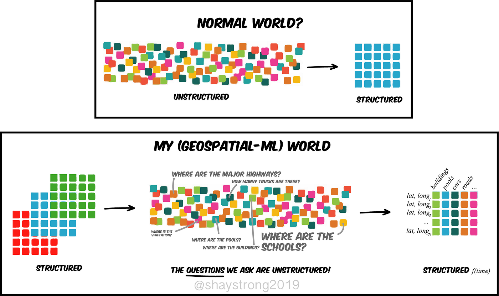

### Spatial Dependency

One of the defining characteristics of geospatial data is **spatial dependency**, also known as spatial autocorrelation. This principle states that observations located close to each other in space are more likely to be similar than those farther apart.

Key aspects:

* Nearby pixels in satellite images often share similar characteristics
* Environmental variables (temperature, vegetation, pollution) vary smoothly across space
* Ignoring spatial dependency can lead to overfitting and misleading performance estimates

This violates the independence assumption used in regular ML and requires specialized handling in GeoAI models.

Management implication:
Standard ML validation techniques may overestimate performance if spatial dependency is not accounted for in train/test splits.

#### Manager's Checkpoint — Spatial Dependency

Before approving a GeoAI project, ask:

* Are training and testing areas geographically separated?
* Could the model be learning spatial patterns rather than the actual features of interest?
* How will performance vary when deployed in new geographic regions?

### Multi-Scale Information

GeoAI problems naturally exist at multiple spatial scales, ranging from fine-grained pixel-level details to broader regional and landscape-level patterns.

Examples of spatial scales:

* **Pixel level:** Individual satellite image pixels used for classification or segmentation
* **Object or region level:** Fields, buildings, water bodies, or administrative regions
* **Landscape level:** Urban growth patterns, forest cover change, or watershed analysis

Models must be capable of learning representations across these scales, which is rarely required in standard ML tasks.

### Multi-Modal Geospatial Data

GeoAI commonly integrates multiple data modalities, each with distinct structures and challenges.

#### Raster Data

* Grid-based data such as satellite and aerial imagery
* Each pixel contains continuous or categorical values
* Typically processed using CNNs and deep learning models

#### Vector Data

* Discrete spatial features such as roads, boundaries, rivers, and land parcels
* Represented as points, lines, and polygons
* Often analyzed using graph-based or feature-engineered ML approaches

#### Point Clouds (LiDAR)

* 3D spatial data capturing elevation and surface structure
* Used for terrain modeling, urban mapping, and vegetation analysis
* Requires specialized 3D or voxel-based learning techniques

Handling these heterogeneous data types together is a unique challenge in GeoAI.

#### Manager's Checkpoint — Data Complexity

Ask:

* Do we have multiple data types that need to be integrated?
* Are our models designed to handle the specific characteristics of geospatial data?
* What additional complexity does multi-modal data introduce to the project?

## Model Landscape in GeoAI

The GeoAI model landscape consists of a diverse set of algorithms designed to handle different types of geospatial data and problem complexities. Unlike general machine learning, GeoAI requires models that can capture **spatial context, spatial dependency, and multi-scale patterns**.

Broadly, GeoAI models can be grouped into three major categories: **Classical Machine Learning**, **Deep Learning (CNN-based models)**, and **Transformer-based models**.

### Classical Machine Learning Models

Classical machine learning models were among the first to be applied in geospatial analysis and are still widely used, especially when data availability is limited.

Common models:

* Random Forest
* Support Vector Machines (SVM)
* Gradient Boosting
* Logistic Regression

Characteristics:

* Work well with handcrafted spatial features
* Suitable for tabular or vector-based geospatial data
* Easier to interpret and faster to train
* Limited ability to capture complex spatial patterns

Typical use cases:

* Land-use classification using derived features
* Environmental risk mapping
* Spatial suitability analysis

Management implication:
Classical ML models are often sufficient for projects with limited data or when interpretability is crucial, but they may not capture complex spatial relationships.

### Deep Learning Models (CNN-based)

Deep learning, particularly Convolutional Neural Networks (CNNs), has significantly advanced GeoAI by enabling direct learning from raw spatial data.

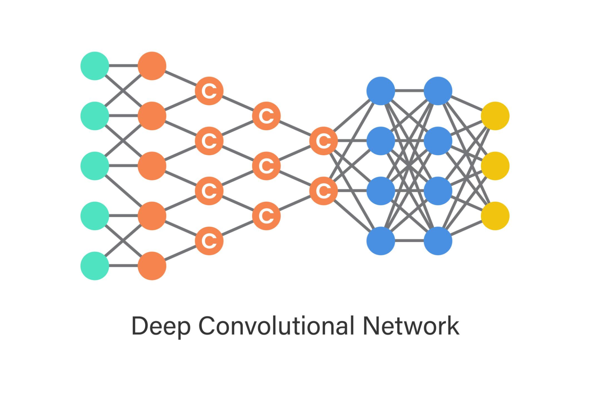

Key strengths:

* Automatically learn spatial features from raster data
* Capture local spatial patterns effectively
* Support pixel-level tasks such as segmentation

Common architectures:

* CNNs
* U-Net
* ResNet
* Fully Convolutional Networks (FCNs)

Typical use cases:

* Satellite image classification
* Object detection (buildings, roads, ships)
* Change detection in remote sensing imagery

Management implication:
CNN-based models require larger datasets and more computational resources but can achieve higher accuracy on complex visual tasks.

### Transformer-Based Models

Transformer-based models represent the latest advancement in GeoAI, extending attention mechanisms to spatial and spatio-temporal data.

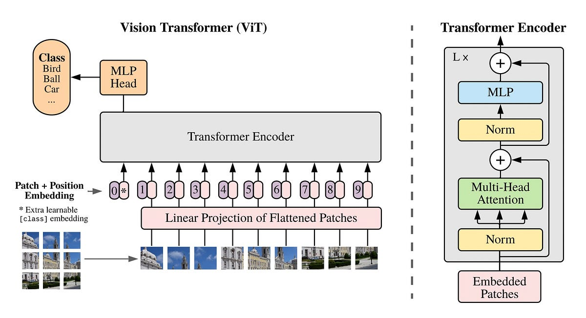

Key strengths:

* Capture long-range spatial dependencies
* Model global context better than CNNs
* Highly scalable with large datasets

Examples:

* Vision Transformers (ViT)
* Swin Transformer
* Spatio-temporal transformers

Typical use cases:

* Large-area land cover mapping
* Multi-temporal satellite image analysis
* Global-scale climate and environmental modeling

#### Manager's Checkpoint — Model Selection

Before choosing a model approach, consider:

* What is the complexity of the spatial patterns we need to detect?
* How much labeled training data do we have available?
* What are our computational resource constraints?
* Is model interpretability important for this application?

## Why Convolutional Neural Networks (CNNs) Dominate GeoAI

Convolutional Neural Networks (CNNs) have become the dominant modeling approach in GeoAI due to their ability to automatically learn spatial and contextual features from geospatial imagery. Unlike classical machine learning models, which rely heavily on manually engineered features, CNNs operate directly on raw pixel values and exploit spatial dependencies inherent in remote sensing data.

### Automatic Learning of Spatial Patterns

CNNs use convolutional filters that slide across an image to learn hierarchical representations of spatial patterns. Early layers capture low-level features such as edges and gradients, while deeper layers learn complex structures such as buildings, roads, vegetation patterns, and land parcels.

This hierarchical feature learning allows CNNs to adapt to diverse geospatial environments without explicit feature engineering.

### Spatial Characteristics Captured by CNNs

CNNs are particularly effective in capturing multiple spatial attributes that are critical in geospatial analysis:

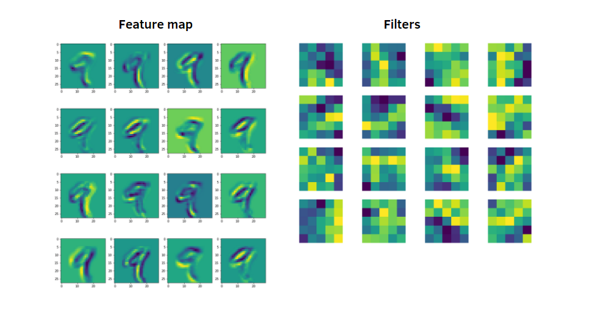

* **Shape:** CNNs identify object shapes and boundaries, enabling accurate detection of man-made and natural features
* **Texture:** Through repeated convolution and pooling operations, CNNs learn texture patterns that distinguish different land-cover types
* **Context:** CNNs consider neighborhood information, allowing them to understand spatial relationships between adjacent pixels

### Suitability for High-Resolution Imagery

Modern Earth observation platforms produce high-resolution satellite and aerial imagery that contains rich spatial detail. CNNs are well-suited to process such data because they preserve spatial structure and can scale across large image dimensions.

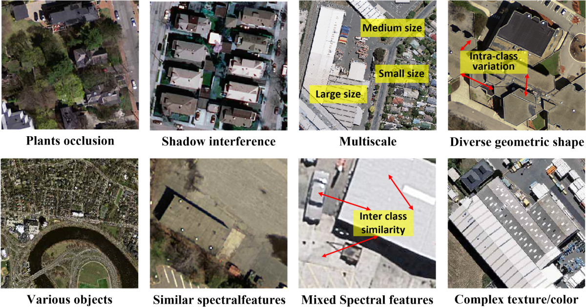

Management implication:
CNNs are most effective when working with high-resolution imagery where spatial detail and context are important for accurate classification or detection.

#### Manager's Checkpoint — CNN Suitability

Ask:

* Are we working with high-resolution imagery that contains rich spatial detail?
* Do we need to detect complex spatial patterns or objects?
* Can we invest in the computational resources required for CNN training?

## CNN Applications in GeoAI

CNNs have enabled significant advancements in GeoAI by supporting a wide range of geospatial vision tasks. Their ability to learn spatial, spectral, and contextual features makes them highly effective for analyzing satellite and aerial imagery.

### Image Classification

Image classification involves assigning a single label to an entire image or image patch. In GeoAI, this task is commonly used for scene-level understanding, such as identifying urban, agricultural, forest, or water-dominated regions.

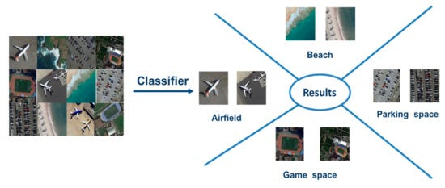

Applications include:

* Regional land cover categorization
* Crop type identification at patch level
* Environmental zone classification

### Semantic Segmentation

Semantic segmentation is a pixel-level classification task in which each pixel is assigned a class label. This is one of the most important CNN applications in GeoAI, as it enables detailed and accurate mapping of Earth surface features.

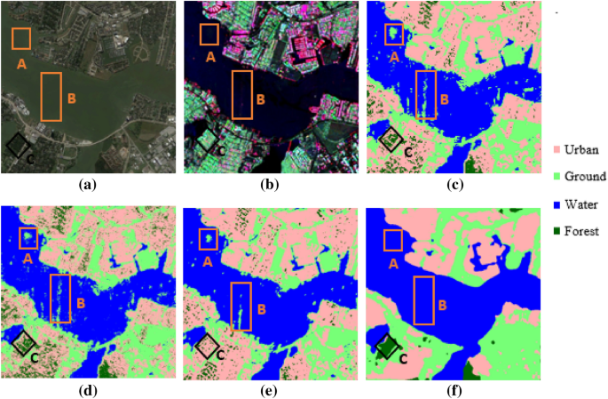

Applications include:

* Building footprint extraction
* Road and transportation network mapping
* Land use and land cover (LULC) mapping

Semantic segmentation significantly reduces the "salt-and-pepper" effect commonly observed in classical ML outputs by incorporating neighborhood context.

### Object Detection

Object detection focuses on identifying and localizing individual objects within an image using bounding boxes. Unlike semantic segmentation, object detection distinguishes between separate instances of the same class.

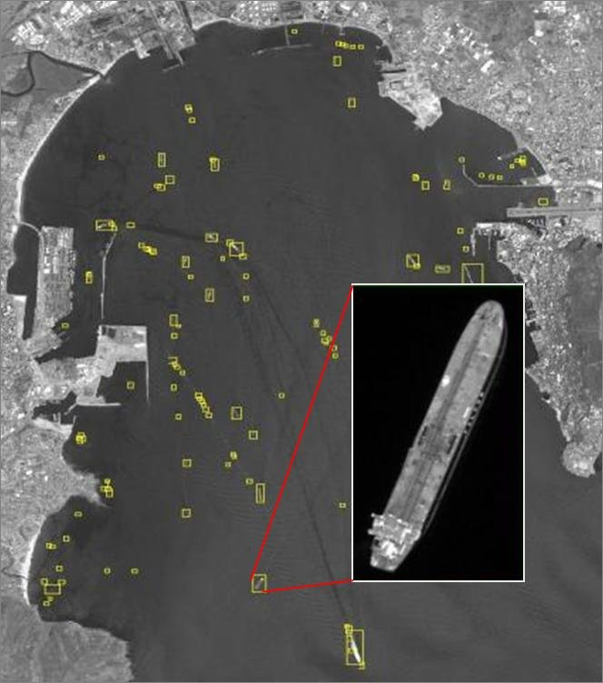

Applications include:

* Ship detection in maritime surveillance
* Vehicle detection in urban environments
* Infrastructure monitoring (towers, containers, vessels)

This task is widely used in defense, logistics, and port management systems.

### Change Detection

Change detection involves identifying differences between images acquired at different time points over the same geographic area. CNNs can learn temporal and spatial variations, enabling accurate detection of changes caused by natural or human activities.

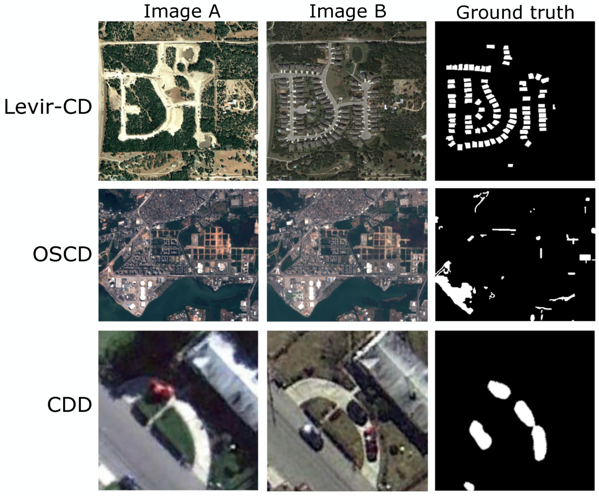

Applications include:

* Urban expansion monitoring
* Deforestation and land degradation analysis
* Disaster impact assessment (floods, earthquakes, fires)

#### Manager's Checkpoint — Application Selection

Consider:

* What level of detail do we need in our outputs (scene-level, pixel-level, or object-level)?
* Are we monitoring changes over time or analyzing static conditions?
* What is the primary use case for the generated maps or detected objects?

## CNN Architectures Used in GeoAI

A wide range of CNN architectures are used in GeoAI, each optimized for specific geospatial vision tasks such as segmentation, feature extraction, and object detection. These architectures are adapted to handle large satellite images, multi-band data, and multi-sensor inputs commonly found in remote sensing workflows.

### U-Net for Semantic Segmentation

U-Net is one of the most widely adopted architectures for **semantic segmentation** in GeoAI. It follows an encoder–decoder structure with skip connections that transfer spatial details from shallow layers to deeper layers.

Why U-Net works well in GeoAI:

* Preserves fine spatial details such as object boundaries
* Produces pixel-level classification maps
* Performs well even with limited labeled data

Common use cases:

* Building footprint extraction
* Road and river segmentation
* Land Use and Land Cover (LULC) mapping

### ResNet and EfficientNet for Feature Extraction

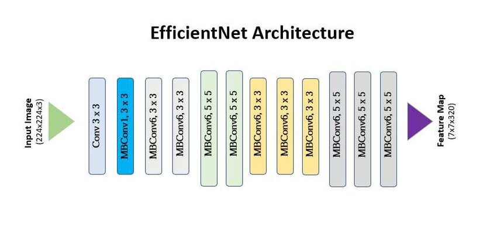

ResNet and EfficientNet are commonly used as **backbone networks** in GeoAI models. They extract rich hierarchical features from satellite imagery, which are then used for classification, segmentation, or detection tasks.

Key characteristics:

* **ResNet:** Uses residual connections to enable deep networks without vanishing gradients
* **EfficientNet:** Balances depth, width, and resolution for computational efficiency

Applications in GeoAI:

* Patch-based image classification
* Backbone for U-Net, DeepLab, and detection models
* Transfer learning from large image datasets

### YOLO and Faster R-CNN for Object Detection

Object detection architectures are used to **identify and localize discrete objects** in geospatial imagery using bounding boxes.

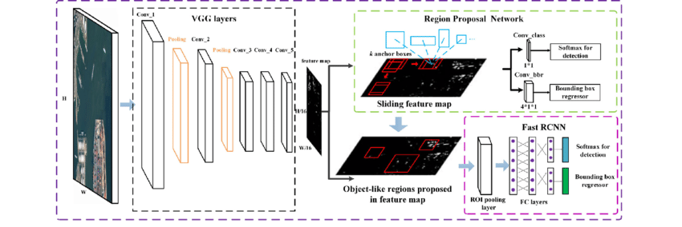

Architecture comparison:

**YOLO (You Only Look Once):**
* Single-stage detector
* Very fast inference
* Suitable for real-time or large-area mapping

**Faster R-CNN:**
* Two-stage detector
* Higher accuracy
* Better for detecting small or densely packed objects

GeoAI use cases:

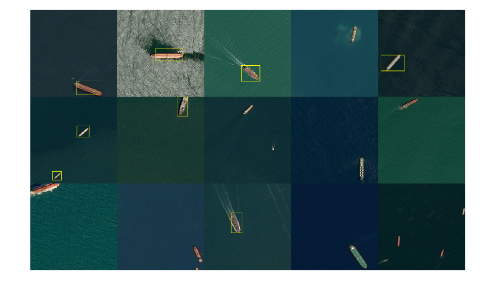

* Ship detection in maritime monitoring
* Vehicle and aircraft detection
* Infrastructure and asset monitoring

### Multi-Band and Multi-Sensor Inputs

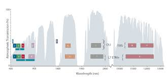

Unlike natural images, GeoAI models often operate on **multi-band and multi-sensor data**, including optical, radar, and elevation sources.

Typical inputs include:

* Multispectral bands (RGB, NIR, SWIR)
* Radar data (SAR) for all-weather monitoring
* Multi-sensor fusion (e.g., optical + SAR)

CNNs can ingest these inputs as stacked channels, enabling robust performance across varying environmental conditions.

### Patch-Based Training for Large Satellite Images

Satellite images are often extremely large and cannot be processed directly by CNNs due to memory constraints. Patch-based training addresses this challenge by dividing large images into smaller fixed-size tiles.

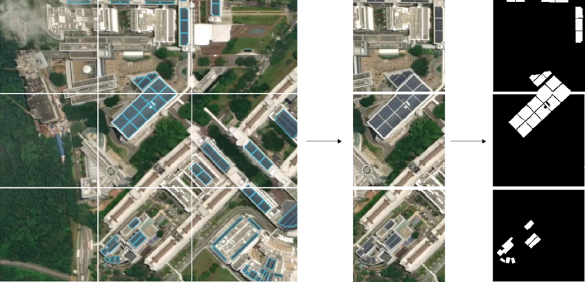

Advantages of patch-based training:

* Enables training on ultra-high-resolution imagery
* Improves dataset size and diversity
* Compatible with most CNN architectures

Patch-based inference allows predictions to be stitched back together to generate full-scene maps.

#### Manager's Checkpoint — Architecture Selection

Ask:

* What type of output do we need (pixel-level maps, object detections, or scene classifications)?
* Do we have multi-band or multi-sensor data that needs to be integrated?
* What are our accuracy requirements versus computational constraints?

## Transformers in GeoAI

Transformers are increasingly being adopted in GeoAI due to their ability to model **long-range spatial dependencies** and capture **global contextual information** across large geographic extents. Originally developed for natural language processing, Transformer architectures have been successfully adapted to remote sensing and geospatial analysis.

### Why Transformers Matter in GeoAI

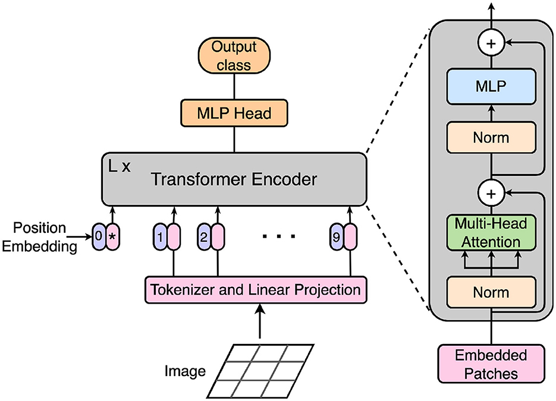

Unlike CNNs, which rely on local convolutional kernels, Transformers use **self-attention mechanisms** that allow every pixel or patch to attend to all others in an image. This enables:

* Modeling of long-range spatial relationships
* Better understanding of large-scale spatial patterns
* Global consistency in predictions

This capability is especially valuable in geospatial imagery, where spatial patterns often extend across large regions.

### Long-Range Spatial Dependency and Global Context

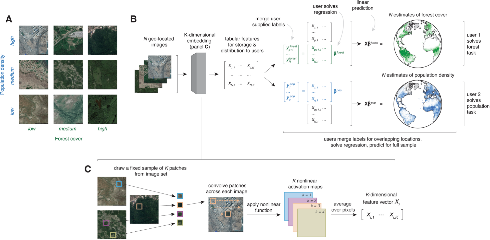

Transformers excel at capturing **global context**, making them more effective than CNNs for tasks where distant spatial relationships matter. For example, land cover classes such as forests, agricultural zones, or urban regions often span wide areas and cannot be accurately modeled using local receptive fields alone.

Key advantages over CNNs:

* No fixed receptive field
* Better handling of spatial heterogeneity
* Reduced boundary inconsistencies over large regions

### Use Cases of Transformers in GeoAI

#### Large-Area Land Cover Mapping

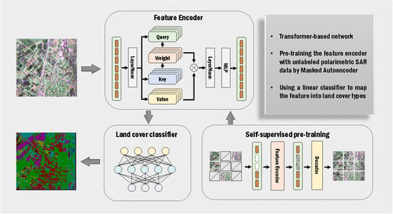

Transformers are well-suited for **large-area and continental-scale land cover mapping**, where capturing global spatial patterns is essential. Their attention-based design helps maintain consistency across large geographic extents.

#### Multi-Temporal and Time-Series Analysis

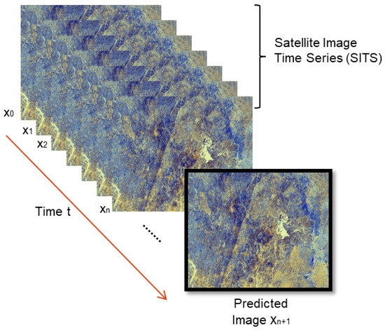

Transformers naturally handle sequential data, making them effective for analyzing time-series of satellite imagery to detect changes, monitor seasonal patterns, and track long-term environmental trends.

Management implication:
Transformers are most valuable for large-scale mapping projects where global consistency and long-range spatial relationships are important, but they require substantial computational resources.

#### Manager's Checkpoint — Transformer Adoption

Consider:

* Are we working with large geographic areas where global consistency matters?
* Do we need to model long-range spatial relationships?
* Do we have the computational resources to support transformer-based models?
* Is the additional complexity justified by improved performance?

## Model Evaluation in GeoAI

Evaluating GeoAI models requires more than standard accuracy metrics. In addition to traditional evaluation measures such as accuracy, precision, recall, and F1-score, GeoAI evaluation must consider spatial aspects that are unique to geospatial data.

### Spatial Cross-Validation

Standard cross-validation techniques can be misleading in GeoAI due to spatial autocorrelation. **Spatial cross-validation** ensures that training and testing data are spatially independent by creating geographic buffers between training and test areas.

Key principles:

* Training and testing areas should be geographically separated
* Buffer zones prevent spatial leakage between datasets
* Multiple spatial folds test generalization across different regions

Management implication:
Spatial cross-validation provides more realistic performance estimates for operational deployment but may show lower accuracy than standard validation.

### Error Distribution Analysis

Rather than only measuring how many errors occur, GeoAI evaluation should examine **where errors occur geographically**. This spatial analysis of errors can reveal:

* Systematic biases in certain geographic regions
* Performance variations across different landscape types
* Areas where additional training data may be needed

### Spatial Metrics

Traditional accuracy metrics should be supplemented with spatial-specific measures:

* **Spatial RMSE:** Root mean square error that accounts for spatial distribution of errors
* **Moran's I:** Measures spatial autocorrelation in prediction errors
* **Spatial consistency:** Evaluates smoothness and coherence of predictions

### Temporal Consistency

For time-series geospatial data, models must be evaluated across time as well as space to ensure:

* Consistent performance across different seasons
* Ability to handle temporal variations in data
* Stability of predictions over time

#### Manager's Checkpoint — Evaluation Strategy

Ask:

* Are we using spatially independent validation data?
* Do we understand where and why the model makes errors?
* How will performance vary across different geographic regions and time periods?
* Are our evaluation metrics appropriate for the intended use case?

## Classical Machine Learning Models in GeoAI

Classical Machine Learning (ML) models have played a foundational role in the evolution of GeoAI and remain widely used in geospatial analysis due to their simplicity, robustness, and interpretability. These models rely on handcrafted features derived from remote sensing data and are particularly effective when training data is limited or when model explainability is a priority.

### Commonly Used Classical ML Models

The most frequently applied classical ML models in GeoAI include:

* **Random Forest (RF):** An ensemble-based algorithm that constructs multiple decision trees and aggregates their predictions. RF is highly robust to noise, handles high-dimensional data well, and provides feature importance measures, making it one of the most popular models in remote sensing applications.
* **Support Vector Machines (SVM):** SVMs are margin-based classifiers that perform well on small to medium-sized datasets. With appropriate kernel selection (e.g., radial basis function), SVMs are effective in separating complex, non-linear geospatial patterns.
* **Gradient Boosting Methods:** These models build decision trees sequentially, where each new tree corrects errors made by previous ones. Gradient boosting techniques often achieve high classification accuracy but require careful tuning to avoid overfitting.

### Input Features for Classical ML Models

Unlike deep learning approaches, classical ML models depend heavily on manually engineered features extracted from satellite imagery and geospatial datasets. Common input features include:

* **Spectral Bands:** Raw reflectance values from multispectral or hyperspectral sensors (e.g., visible, near-infrared, shortwave infrared bands)

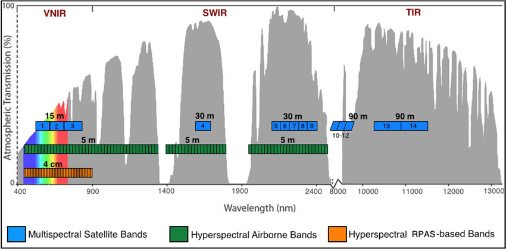

* **Spectral Indices:** Vegetation and water-related indices such as:
  * Normalized Difference Vegetation Index (NDVI)
  * Normalized Difference Water Index (NDWI)
  
  These indices enhance specific land surface characteristics and improve class separability.

* **Texture Features:** Statistical texture measures derived from gray-level co-occurrence matrices (GLCM), such as contrast, homogeneity, and entropy. These features help capture spatial variability within image patches.

### GeoAI Use Cases

Classical ML models have been extensively applied across a wide range of geospatial applications, including:

* **Land Use and Land Cover (LULC) Classification:** Identifying and categorizing surface features such as forests, urban areas, water bodies, and agricultural land.

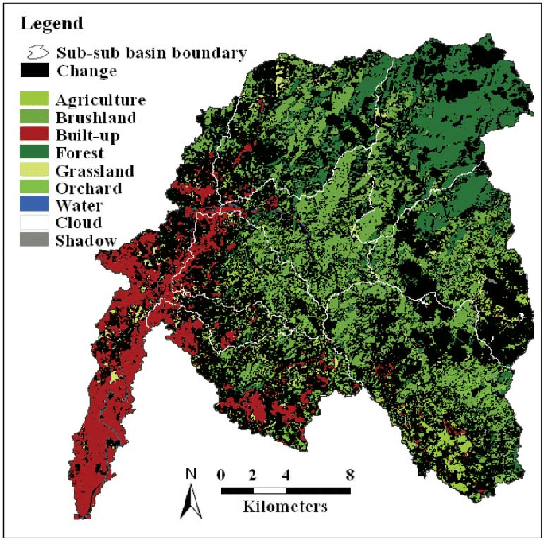

* **Crop Type Mapping:** Differentiating crop varieties using seasonal spectral signatures and vegetation indices, particularly in precision agriculture and food security studies.

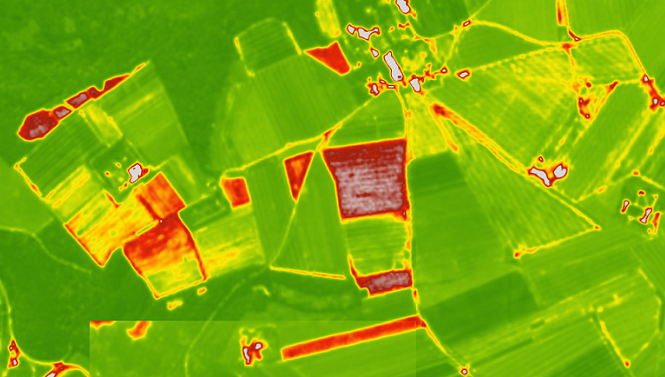

These models are commonly used with medium-resolution satellite data where pixel-based classification is sufficient.

### Advantages and Limitations

**Advantages:**

* High interpretability, making results easier to explain to domain experts and policymakers
* Faster training and inference compared to deep learning models
* Effective performance with limited labeled datasets
* Lower computational requirements

**Limitations:**

* Inability to inherently capture spatial and contextual relationships between neighboring pixels
* Heavy dependence on feature engineering and domain expertise
* Performance saturation on complex, high-resolution imagery compared to deep learning models

### Summary

Classical machine learning models remain a reliable and efficient choice for many GeoAI tasks, particularly when interpretability, speed, and limited data availability are key considerations. However, their limited ability to model spatial context has led to increasing adoption of deep learning approaches for more complex geospatial problems.

## CNNs in 3D GIS and Point Cloud Analysis

With the increasing availability of three-dimensional geospatial data, GeoAI has expanded beyond 2D imagery to include **3D GIS datasets and point clouds**. CNN-based deep learning techniques, along with specialized neural architectures, enable effective analysis of elevation, structure, and volumetric information critical for urban and infrastructure intelligence.

### Data Types in 3D GeoAI

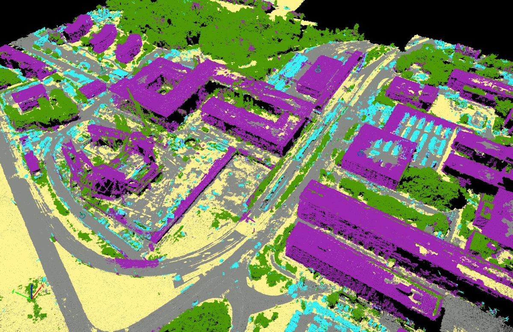

3D GeoAI relies on multiple elevation-aware data sources:

* **LiDAR (Light Detection and Ranging):** Produces dense point clouds representing precise 3D coordinates of terrain, buildings, and vegetation.
* **Digital Surface Model (DSM):** Represents the Earth's surface including objects such as buildings and trees.
* **Digital Terrain Model (DTM):** Represents bare-earth elevation after removing surface objects.

These data types provide vertical information that is not available in standard 2D satellite imagery.

### CNN Techniques for 3D Data

#### Voxel-Based CNNs

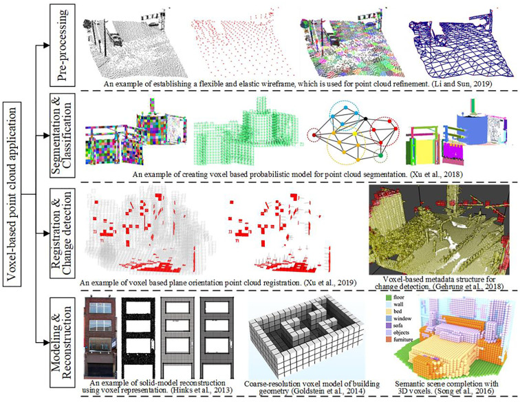

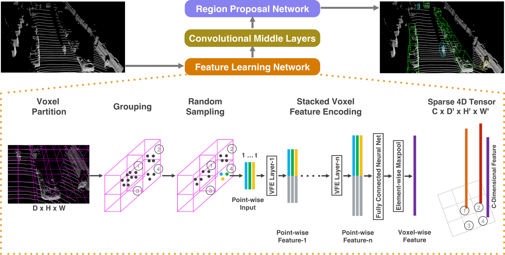

Voxel-based CNNs convert irregular point clouds into structured 3D grids (voxels), allowing the use of 3D convolution operations.

Key characteristics:

* Enables use of standard CNN operations in 3D
* Captures volumetric spatial context
* Suitable for dense point clouds

**Limitation:** High memory and computational requirements as voxel resolution increases.

#### PointNet and PointNet++

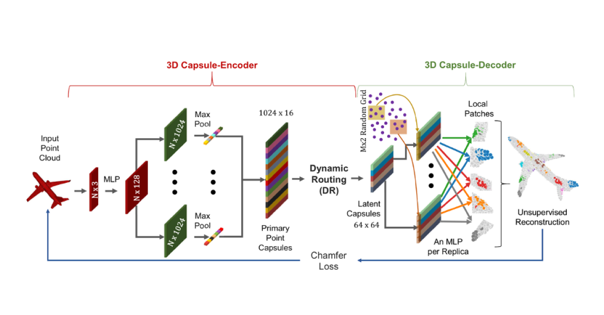

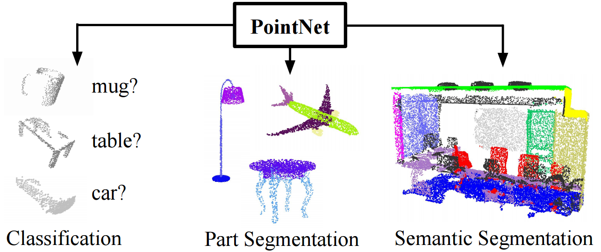

PointNet-based architectures process raw point clouds directly without voxelization. They learn features from unordered point sets using shared multilayer perceptrons and aggregation functions.

Advantages:

* Avoids information loss from voxelization
* Efficient handling of sparse and irregular data
* Captures local and global geometric features

**PointNet++** extends this approach by learning hierarchical local features, making it more effective for complex scenes.

### Applications of CNNs in 3D GIS

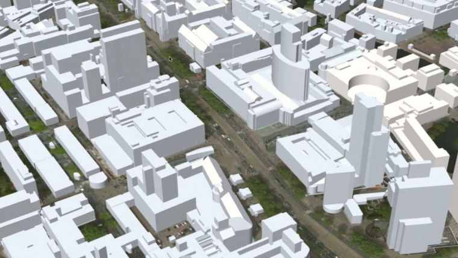

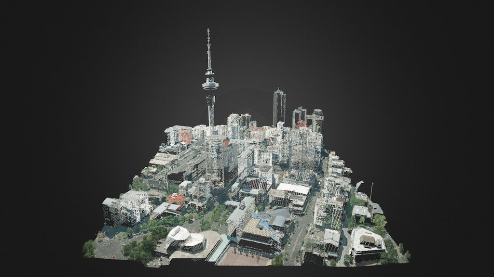

CNN-based 3D GeoAI models enable advanced spatial analysis, including:

* **Building Height Estimation:** Extracting vertical attributes of buildings for urban planning, taxation, and disaster risk assessment.
* **Urban Mapping:** Creating detailed 3D city models that capture building shapes, road elevations, and infrastructure layouts.
* **Infrastructure Analysis:** Monitoring bridges, power lines, and urban assets using elevation-aware data.

### Challenges in 3D GeoAI

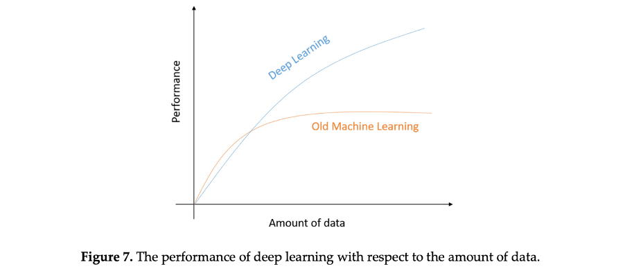

Despite their potential, CNN-based 3D GeoAI systems face several challenges:

* **Data Sparsity:** Point clouds are often unevenly distributed, leading to missing or sparse regions.
* **High Computational Cost:** 3D convolutions and large point sets require significant memory and processing power.
* **Scalability Issues:** Processing city-scale or national-scale LiDAR datasets remains computationally intensive.

### Summary

CNNs and deep learning architectures have significantly advanced **3D GIS and point cloud analysis** by enabling automated extraction of height, structure, and volumetric information. Techniques such as **voxel-based CNNs** and **PointNet-style models** allow GeoAI systems to move beyond 2D mapping into true three-dimensional spatial intelligence. However, challenges related to data sparsity and computational demands continue to shape research and operational deployment.

## Key Takeaways for Project Managers

GeoAI models differ fundamentally from standard machine learning approaches due to the spatial nature of geospatial data. Understanding these differences is crucial for successful project planning and execution.

### Model Selection Depends on Data and Task

There is no single "best" model in GeoAI. Effective solutions depend on aligning **model capability** with **data characteristics** and **application requirements**.

Key decision factors:

* **Data type:** Raster data favors CNNs/Transformers, vector data works well with classical ML
* **Spatial resolution:** High-resolution imagery benefits from deep learning approaches
* **Problem complexity:** Simple classification may work with classical ML, complex patterns need deep learning
* **Scale:** Large-area mapping may benefit from Transformers, local analysis from CNNs

### Spatial Considerations Are Critical

Traditional ML assumptions don't apply to geospatial data:

* Spatial dependency affects model training and validation
* Geographic separation of training/test data is essential
* Performance may vary significantly across different regions
* Long-range spatial relationships may be important

### Evaluation Must Be Spatially Aware

Standard accuracy metrics are insufficient for GeoAI:

* Use spatial cross-validation for realistic performance estimates
* Analyze error distribution geographically
* Consider spatial consistency and temporal stability
* Validate across different geographic regions and conditions

#### Manager's Checkpoint — Project Success Factors

Before approving a GeoAI project, ensure:

* Model selection aligns with data characteristics and project requirements
* Validation strategy accounts for spatial dependencies
* Evaluation includes spatial and temporal considerations
* Team understands the unique challenges of geospatial data
* Computational resources match model requirements
* Performance expectations are realistic for the chosen approach