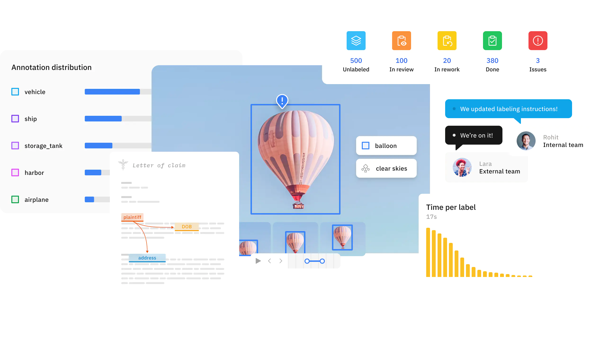

# Introduction to Open-Source GeoAI Tools & Platforms

## The GeoAI Workflow at a Glance

GeoAI is best understood as a workflow rather than a single tool or technology. Different software components support different stages, and successful implementation depends on how well these pieces are connected.

For project managers, this perspective is important because responsibilities, skill sets, and infrastructure needs differ across stages. GIS teams, data engineers, and AI specialists each contribute at specific points in the pipeline.

### Stages in a Typical GeoAI Pipeline

A typical GeoAI pipeline moves through the following stages:

Data acquisition :
Imagery, elevation models, LiDAR, and vector layers are collected from satellite missions, aerial surveys, or existing GIS databases.

Data preparation :
Raw datasets are cleaned, aligned, reprojected, tiled, and standardized so they can be used as structured inputs for machine learning.

Annotation and labeling :
Reference data is created or curated to provide examples of the features the model should learn, such as buildings, roads, or land cover types.

Model training :
Machine learning frameworks use the prepared data and labels to learn patterns. This is the computationally intensive stage where models are built.

Inference (prediction) :
The trained model is applied to new, unseen data to generate outputs such as classification maps or extracted features.

Post-processing and GIS integration :
Model outputs are converted into GIS-ready formats, reviewed, corrected if needed, and combined with other spatial layers.

Sharing and deployment : 
Final results are published through web services, dashboards, or decision-support systems for use by stakeholders.

Manager’s perspective:
Each stage has different risks and resource needs. Early stages are data-intensive, training requires compute capacity, and later stages require GIS validation and dissemination infrastructure.

### Roles of GIS, AI, and Data Engineering Tools

GeoAI workflows combine tools and skills from three domains.

GIS tools focus on spatial data handling and interpretation. They are used for inspecting datasets, preparing labels, validating outputs, and integrating AI results into mapping products.

AI and machine learning tools focus on pattern learning. They handle model training, parameter tuning, and large-scale inference on imagery or other spatial inputs.

Data engineering tools focus on managing large datasets and processing workflows. They support data conversion, tiling, storage management, and automation of repetitive tasks.

These domains are complementary rather than competitive. GIS expertise ensures spatial correctness and interpretability, AI tools provide scalable pattern recognition, and data engineering enables reliable processing at large volumes.

Manager’s perspective:
Understanding these roles helps in planning teams and responsibilities. Not every GIS team needs to become AI developers, but they must collaborate with technical specialists while maintaining control over data quality and final outputs.

## Free and Open Geospatial Data Sources

A major advantage in modern GeoAI work is the availability of high-quality open datasets. These sources allow organizations to experiment, prototype, and even operationalize workflows without immediate dependence on commercial data licenses.

For project managers, knowing what is freely available helps in early-stage planning, pilot design, and cost estimation.

### Satellite and Aerial Imagery Sources

Several satellite missions provide open imagery suitable for GeoAI tasks such as land cover mapping, change detection, and environmental monitoring.

European Space Agency provides Sentinel missions, including Sentinel-2 optical imagery and Sentinel-1 radar data. These offer global coverage with frequent revisits.

NASA and USGS provide Landsat imagery, a long-running archive valuable for historical and multi-temporal analysis.

In some regions, governments also release open aerial imagery that can support high-resolution mapping and training data creation.

Manager takeaway:
Freely available imagery is often sufficient for many regional and national GeoAI applications, especially in environmental and land use domains.

### Elevation and LiDAR Data Sources

Elevation data adds terrain context that can improve model performance in tasks such as flood mapping, landslide susceptibility, and infrastructure planning.

Global digital elevation models, such as those derived from satellite missions, provide consistent terrain coverage at moderate resolution.

In some countries, government agencies release open LiDAR datasets that offer high-resolution 3D information about terrain and structures. These are particularly useful for urban modeling and vegetation analysis.

Manager takeaway:
Elevation and LiDAR data are valuable complementary inputs for GeoAI, especially where terrain influences the features of interest.

### Open Vector and Map Data

OpenStreetMap provides openly licensed global vector data, including roads, buildings, and land use features. It is widely used both as reference data and as a source of training labels for GeoAI models.

Many national and regional governments also publish open vector datasets such as administrative boundaries, infrastructure networks, and thematic layers.

Manager takeaway:
Open vector data can significantly reduce the effort required to create training labels, but quality and completeness should be assessed before operational use.

### Repositories of Pretrained GeoAI Models

Public model repositories allow teams to start from existing trained models rather than building everything from scratch.

Hugging Face hosts a wide range of machine learning models, including some adapted for remote sensing and geospatial imagery.

Tools such as samgeo adapt general computer vision models to geospatial contexts, enabling rapid experimentation in tasks like feature extraction.

Manager takeaway:
Pretrained models can accelerate pilots and proofs of concept, but they must be validated against local data before operational deployment.

Good idea — this section should show that preprocessing is a **rich ecosystem**, not just one or two tools. Below is an expanded version with additional widely used open-source tools, still framed at a manager-awareness level.

---

## Tools for Data Cleaning and Preprocessing

Before any model is trained, geospatial data must be inspected, corrected, aligned, and standardized. This stage relies heavily on established geospatial processing tools rather than AI frameworks.

For managers, this phase is where traditional GIS expertise and data engineering practices enable reliable GeoAI outcomes.

### Desktop GIS for Inspection and Preparation

Desktop GIS platforms are central for visual inspection and manual preparation.

QGIS is widely used for:

* Verifying alignment between imagery and vector labels
* Clipping and masking datasets
* Reprojecting layers
* Creating and editing training polygons

Other open-source GIS tools such as GRASS GIS and SAGA GIS provide advanced terrain analysis, raster processing, and environmental modeling functions that are often useful when preparing input features.

Manager takeaway:
Desktop GIS tools remain essential for spatial quality control and feature preparation before data enters AI pipelines.

---

### Raster Data Processing Tools

Raster preprocessing at scale typically relies on command-line or scripted tools.

GDAL is foundational for:

* Reprojection
* Resampling
* Format conversion
* Mosaicking and tiling

Additional tools frequently used in open workflows include:

Rasterio — A Python library built on GDAL that is widely used in GeoAI scripts for reading, writing, and manipulating raster data.

Orfeo Toolbox — Provides advanced remote sensing algorithms, including feature extraction, segmentation, and image filtering.

Manager takeaway:
Raster preparation is often automated and script-driven, forming the backbone of repeatable GeoAI workflows.

---

### LiDAR and Point Cloud Processing Tools

For 3D geospatial data, specialized tools handle large point clouds.

PDAL is widely used for:

* Filtering and classifying LiDAR returns
* Generating terrain and surface models
* Transforming and subsetting large point clouds

CloudCompare is often used for:

* Visual inspection of point clouds
* Manual classification and cleaning
* Quality assessment of 3D data

Manager takeaway:
Point cloud preparation is more specialized but can significantly enhance GeoAI applications involving terrain, structures, and vegetation height.

---

### General Data Engineering and Automation Tools

GeoAI preprocessing often involves automation beyond traditional GIS interfaces.

Commonly used open tools include:

Python — The primary scripting language for geospatial and AI workflows.

Libraries such as:

* GeoPandas for vector data processing
* Shapely for geometric operations
* Fiona for reading and writing vector formats

These tools are used to automate cleaning, transformation, and preparation steps at scale.

Manager takeaway:
Behind many GeoAI systems is a layer of automated data engineering that ensures repeatability and scalability.

## Data Annotation and Labeling Tools

GeoAI models learn from examples, and those examples must be labeled. Data annotation is therefore a production process that converts imagery and spatial data into structured training inputs. It combines GIS expertise with systematic labeling workflows.

For managers, annotation is often the most time-consuming and resource-intensive stage of a GeoAI project, and it requires planning, standards, and quality control.

### Using GIS Data as Training Labels

Existing GIS datasets are often the most valuable source of training labels. Layers such as building footprints, road networks, and land use polygons can be converted into labeled examples for model training.

QGIS is commonly used to:

* Inspect and clean existing vector layers
* Align labels with the imagery used for training
* Convert vector features into raster masks when needed

Key considerations include:

* Ensuring labels are up to date
* Verifying alignment with imagery resolution
* Harmonizing class definitions across datasets

Manager takeaway:
Leveraging existing authoritative GIS data reduces annotation effort, but only if those datasets meet quality and consistency standards.

### Dedicated Image Annotation Platforms

When new labels must be created, dedicated annotation tools are often used. These platforms allow users to draw polygons, bounding boxes, or pixel masks directly on imagery.

Open-source tools such as Label Studio support:

* Collaborative annotation by multiple users
* Support for image segmentation and object detection tasks
* Export of labels in machine learning–ready formats

These tools are particularly useful when:

* Existing GIS data is unavailable or outdated
* New feature types must be mapped
* Large volumes of imagery must be labeled systematically

Manager takeaway:
Annotation platforms enable structured, scalable labeling workflows, especially when multiple annotators are involved.

### Managing Annotation Quality

Annotation quality directly affects model performance. Inconsistent or inaccurate labels lead to unreliable models.

Effective quality management includes:

* Clear annotation guidelines that define class boundaries and edge cases
* Training annotators to ensure consistent interpretation
* Regular review and correction of labeled samples
* Measuring agreement between annotators for critical classes

Version control of labeled datasets is also important to track improvements and corrections over time.

Manager takeaway:
Annotation is not just a drawing task; it is a governed process. Quality control mechanisms are essential to ensure that training data supports reliable model behavior.

Good point — this section should expose managers to the **breadth of the ecosystem**, not just two names. Below is an expanded version with additional widely used open-source frameworks and geospatial ML libraries.

## Machine Learning Frameworks in GeoAI

Behind every GeoAI application is a machine learning framework that performs the actual pattern learning. These frameworks are not GIS software; they are computational engines designed to train and run models at scale. On top of them, specialized geospatial libraries make it easier to work with imagery, tiles, and spatial metadata.

For project managers, the key idea is that GeoAI solutions are typically built in layers: a general AI engine at the base and geospatial adaptations above it.

### Core Deep Learning Frameworks

Most modern GeoAI development relies on a few widely adopted deep learning frameworks.

PyTorch is popular in research and applied computer vision because of its flexibility and strong ecosystem of pretrained models.

TensorFlow is widely used in both research and production systems and supports large-scale deployment.

Keras provides a high-level interface (often running on top of TensorFlow) that simplifies building and training neural networks.

These frameworks handle:

* Neural network design
* Model training using large datasets
* GPU acceleration
* Saving and running trained models

Manager takeaway:
These are foundational AI platforms. Most GeoAI tools and solutions are built using one of these engines.

---

### Geospatial AI Libraries Built on ML Frameworks

Geospatial AI libraries adapt core ML frameworks to work with satellite imagery, aerial photos, and other spatial data formats.

[TorchGeo](https://github.com/torchgeo/torchgeo) extends PyTorch for geospatial datasets, spatial sampling, and metadata handling.

[Raster Vision](https://rastervision.io/) provides an end-to-end workflow for training and running models on geospatial imagery.

[MMDetection](https://mmdetection.readthedocs.io/en/latest/) and MMSegmentation are widely used computer vision libraries that are often adapted for remote sensing applications.

[Detectron2](https://github.com/facebookresearch/detectron2), developed for object detection and segmentation, is also used in overhead imagery tasks such as building and vehicle detection.

Manager takeaway:
These libraries reduce development effort by providing tested model architectures and workflows tailored to imagery analysis. They allow technical teams to focus on data and problem design rather than low-level implementation.

## Cloud-Based Experimentation Environments

GeoAI development often requires software libraries, large datasets, and specialized hardware such as GPUs. Setting up such environments locally can be complex and time-consuming. Cloud-based platforms simplify this by providing ready-to-use computational environments accessible through a web browser.

For project managers, these platforms lower entry barriers, support collaboration, and enable pilot projects without large upfront infrastructure investments.

### Notebook Platforms for GeoAI

Notebook environments combine code, documentation, and results in a single interactive workspace. They are widely used in data science and GeoAI workflows.

Google Colab provides free access to cloud-based notebooks with optional GPU acceleration. It is commonly used for training demos, testing pretrained models, and running small-scale experiments.

Jupyter Notebook and JupyterLab are open-source platforms that can run locally or on cloud servers. Many research and operational teams use them for developing and sharing GeoAI workflows.

These platforms allow users to:

* Access cloud computing resources
* Install and use geospatial and AI libraries
* Share reproducible workflows with colleagues

Manager takeaway:
Notebook platforms are often the fastest way to start experimenting with GeoAI without complex software installation.

### Benefits of Cloud-Based Workflows

Cloud-based GeoAI workflows offer several operational advantages.

Reduced setup complexity:
Users do not need to configure complex local environments. Software libraries and dependencies can be preconfigured.

Access to specialized hardware:
Cloud platforms can provide GPUs and large memory resources that may not be available on standard office computers.

Scalability:
Compute resources can be increased when needed for large training jobs and reduced afterward to control costs.

Collaboration:
Teams can share notebooks and workflows, making it easier to reproduce results and transfer knowledge.

Manager takeaway:
Cloud environments support flexible experimentation and scaling. They are particularly useful for pilot projects, training, and collaborative development before investing in dedicated infrastructure.

## Where Model Training and Inference Happen

One of the most common misunderstandings in GeoAI projects is assuming that model training happens inside desktop GIS software. In reality, GIS platforms and AI training environments serve very different purposes.

Understanding where computation occurs helps managers plan infrastructure, budgets, and team responsibilities more realistically.

### Training Environments vs Desktop GIS

Desktop GIS tools such as QGIS are primarily designed for visualization, editing, spatial analysis, and validation. They are not optimized for large-scale neural network training.

Model training typically happens in environments built for high-performance computation, such as:

* Cloud-based platforms with GPU support
* Dedicated servers with specialized hardware
* Notebook-based environments connected to remote compute resources

After training, model outputs (such as classified rasters or extracted features) are brought back into GIS software for inspection, correction, and integration into mapping workflows.

Manager takeaway:
GIS platforms remain central to data preparation and validation, while AI environments handle the computationally intensive learning and prediction steps.

### Hardware and Compute Considerations (Conceptual)

Training deep learning models requires substantial computational resources, especially when working with high-resolution imagery.

Key concepts for managers:

GPUs vs CPUs:
Graphics Processing Units (GPUs) are designed for parallel numerical operations and significantly speed up deep learning training compared to standard CPUs.

Memory requirements:
High-resolution imagery and large training datasets require sufficient RAM and GPU memory to process data efficiently.

Storage and data transfer:
Large geospatial datasets must be stored and accessed efficiently. Slow data transfer can become a bottleneck even if compute power is available.

Scaling strategies:
Small pilot models may run on modest resources, but national-scale mapping often requires cloud infrastructure or high-performance computing clusters.

Manager takeaway:
Compute planning is a separate dimension from GIS software planning. Successful GeoAI projects align model complexity and data volume with appropriate hardware and cloud resources.

## Bringing AI Outputs Back into GIS

After a model has been trained and applied to imagery, its outputs must be integrated back into standard GIS environments. This step is critical because AI results are rarely used directly without review. They become part of the familiar GIS workflow where experts interpret, validate, and refine them.

For managers, this stage connects advanced AI processing with existing operational mapping practices.

### Loading Model Outputs into GIS

GeoAI models typically produce outputs in common geospatial formats.

These may include:

* Classified raster maps (for example, land cover classes)
* Probability maps indicating model confidence
* Vector features such as building footprints or road lines

Such outputs can be directly loaded into QGIS as GeoTIFF, shapefile, or GeoJSON layers. Once loaded, they behave like any other GIS dataset.

Key considerations:

* Ensuring coordinate systems match existing project data
* Checking that spatial resolution aligns with base imagery
* Managing large file sizes that may affect performance

Manager takeaway:
AI outputs are not separate from GIS — they become new spatial layers that can be stored, styled, and analyzed like traditional datasets.

### Visualization, Editing, and Validation

Once loaded into GIS, model outputs go through the same quality control processes as manually created data.

Visualization:
Symbology and classification tools help experts quickly identify obvious errors or unusual patterns.

Editing:
GIS tools allow manual correction of misclassified areas, refinement of feature boundaries, and removal of false detections.

Validation:
Comparing AI outputs with reference data, field observations, or higher-resolution imagery helps assess reliability. This stage may also include calculating accuracy statistics.

Manager takeaway:
Human expertise remains essential. GeoAI accelerates mapping, but final datasets often result from a combination of automated outputs and expert review.

## Sharing and Hosting GeoAI Results

GeoAI outputs create value only when they are accessible to decision-makers, analysts, and the public. After validation in GIS, results are typically published through web services and interactive applications. This stage integrates GeoAI into existing spatial data infrastructures.

### Publishing Data Services

Validated GeoAI outputs — such as classified rasters or extracted vector features — can be served as standard geospatial web services.

GeoServer is widely used to publish layers through OGC services like WMS, WFS, and WMTS. These services allow AI-generated layers to be consumed by desktop GIS, dashboards, and web applications.

Other open-source servers such as MapServer and TileServer GL are also used to deliver map tiles and vector data efficiently.

Manager takeaway:
GeoAI outputs fit naturally into existing spatial data infrastructures through standard web services.

---

### Web Mapping Frameworks for Visualization (2D)

2D web mapping libraries are commonly used to display GeoAI outputs in browsers.

Leaflet is lightweight and widely used for interactive maps that overlay AI-generated layers.

OpenLayers provides more advanced GIS capabilities in the browser, including support for projections, WMS/WFS services, and vector editing.

MapLibre GL JS supports high-performance vector tile rendering and is often used for large, dynamic datasets.

Manager takeaway:
2D libraries are ideal for dashboards, monitoring portals, and thematic map viewers that communicate GeoAI results to broad audiences.

### 3D and Advanced Visualization Platforms

Some GeoAI outputs benefit from 3D or advanced visual exploration, particularly in urban, terrain, and infrastructure contexts.

Cesium enables interactive 3D globes and terrain visualization directly in the browser.

deck.gl supports high-performance visualization of large geospatial datasets, including 3D layers and point clouds.

Potree is widely used for viewing LiDAR and dense point clouds in a web browser.

These tools help users explore building heights, terrain changes, and dense spatial datasets in ways that are difficult to understand in 2D alone.

Manager takeaway:
3D platforms enhance communication and analysis for complex spatial environments, especially in urban planning, infrastructure, and terrain-related applications.

## Example End-to-End Open-Source GeoAI Workflow

To make the GeoAI ecosystem concrete, it helps to see how different open-source components connect in a practical scenario. This example outlines a simplified workflow for extracting building footprints from satellite imagery and making the results available on the web.

The goal is not to teach coding, but to show that a full pipeline — from model to map — can be implemented using freely available tools.

### Using a Pretrained Model

Instead of training a model from scratch, teams can start with a pretrained model designed for image segmentation.

Repositories such as Hugging Face host models that can be adapted for overhead imagery tasks. Tools like samgeo make it easier to apply general segmentation models to geospatial imagery.

In this stage:

* A suitable pretrained model is selected
* Sample satellite imagery is prepared
* The model is configured for the target feature (e.g., buildings)

Manager takeaway:
Pretrained models reduce development time and are well suited for pilot projects and feasibility studies.

### Running Inference

Inference is the process of applying a trained model to new imagery to generate predictions.

This step is often performed in a cloud notebook environment such as Google Colab, where imagery is processed tile by tile. The output may be a raster mask showing predicted building areas.

Key outputs at this stage:

* Raster prediction layers
* Confidence or probability maps

Manager takeaway:
Inference converts imagery into machine-generated spatial information that can be further refined in GIS.

### GIS Integration

Model outputs are then brought into QGIS for review and refinement.

Typical steps include:

* Converting raster masks into vector polygons
* Removing obvious false detections
* Correcting boundaries and small errors
* Comparing results with reference data or imagery

This stage ensures that automated outputs meet mapping standards and are suitable for operational use.

Manager takeaway:
Human validation and editing remain essential parts of the GeoAI workflow.

### Publishing to the Web

Once validated, the final building layer can be published using GeoServer as a web service.

A web application built with Leaflet can then display the extracted buildings alongside other GIS layers. This allows planners, analysts, and decision-makers to view and use the results in a browser.

Manager takeaway:
An end-to-end GeoAI pipeline can move from pretrained models to operational web maps using entirely open-source components.

